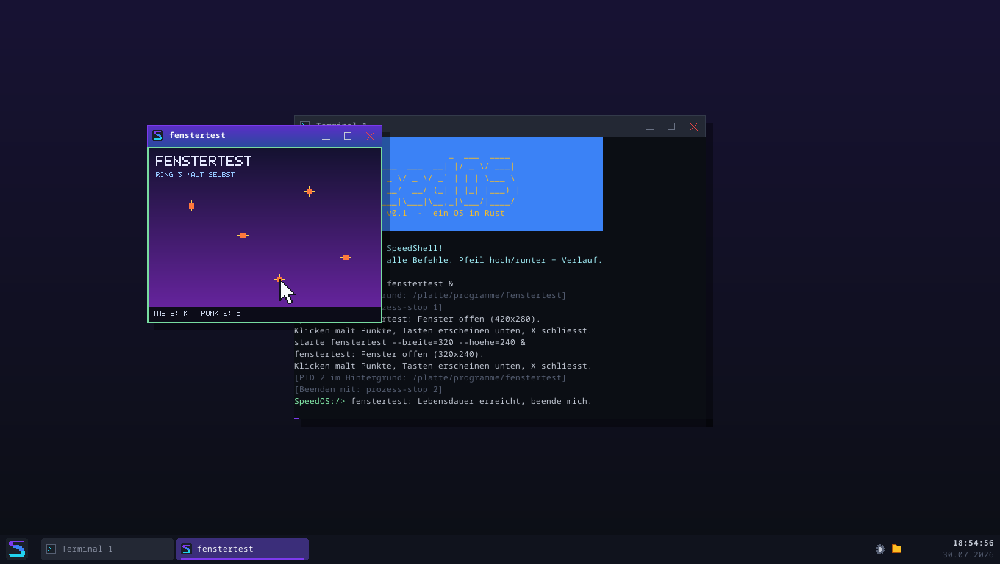
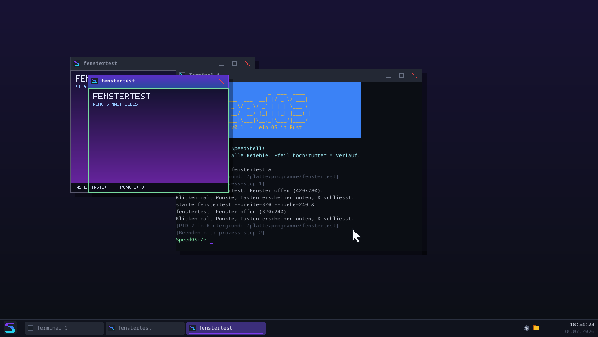
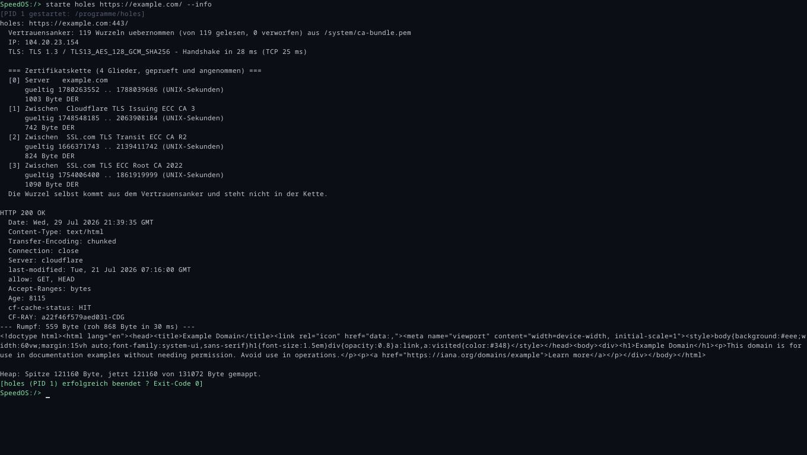
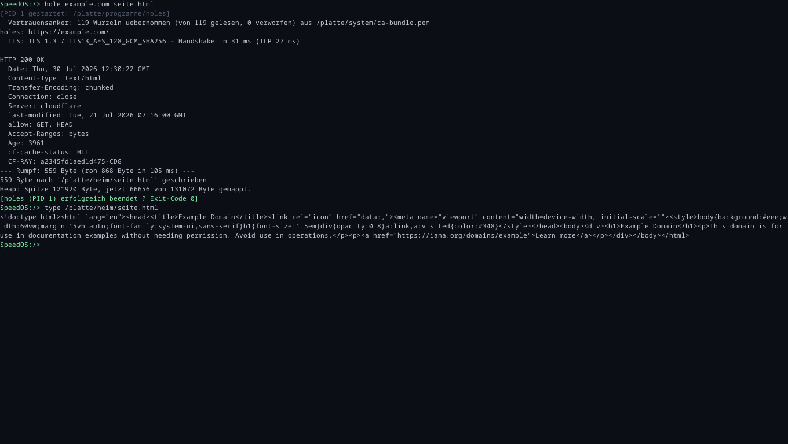
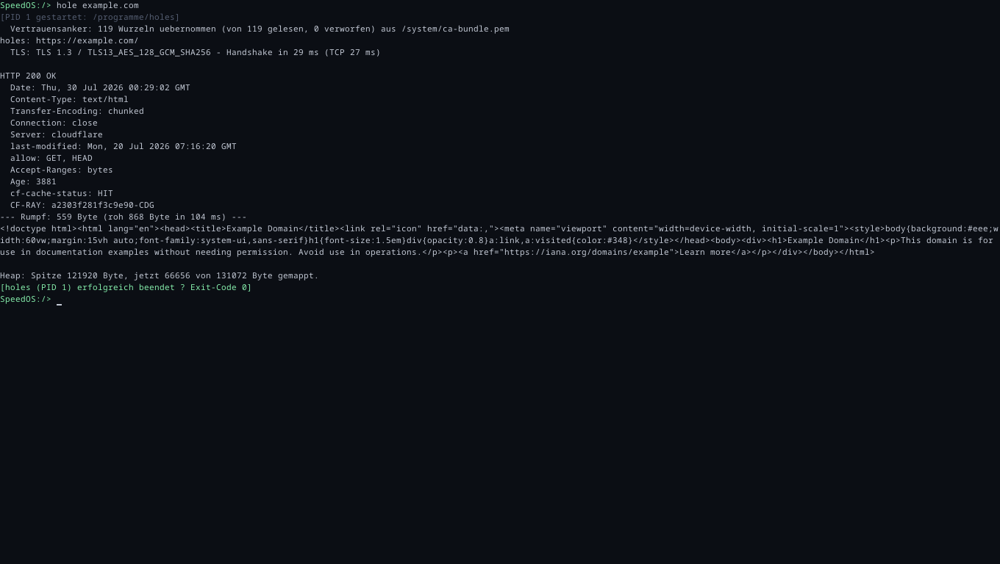
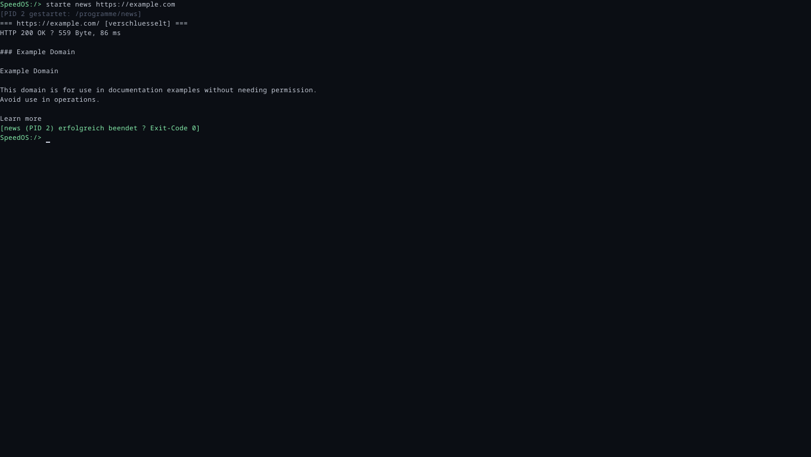
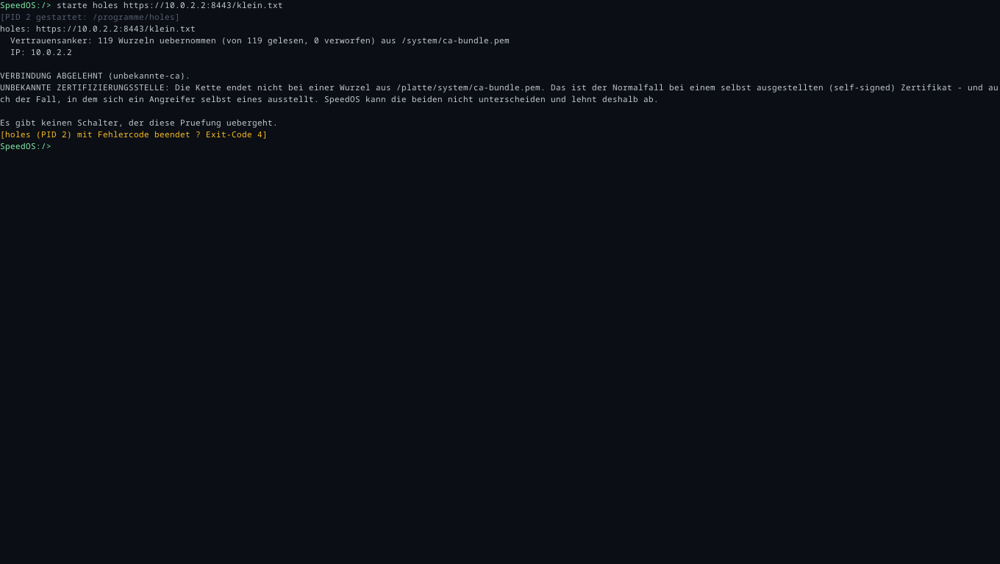
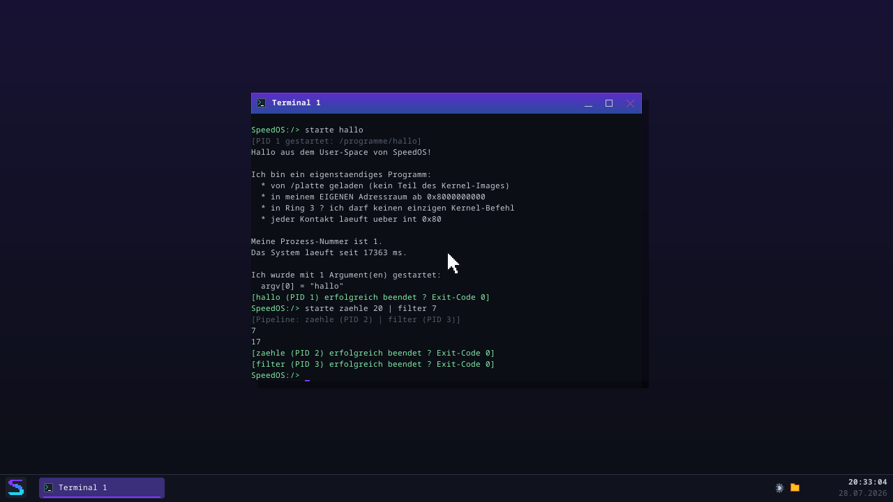
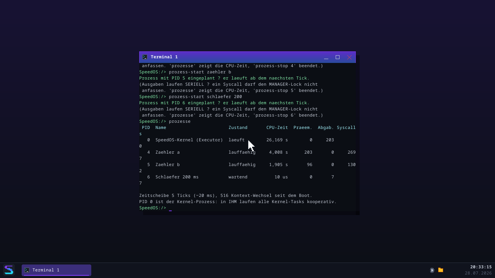
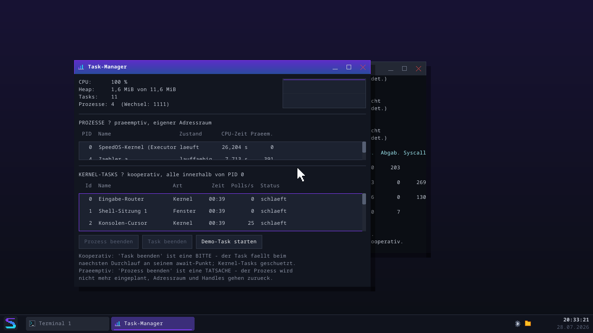

# SpeedOS

Ein Betriebssystem **from scratch in Rust** — kein Linux, keine fremde
Kernel-Basis. Vom Bootsektor bis zur interaktiven Shell mit Dateisystem
ist alles selbst gebaut (auf Basis der bewährten Architektur aus
["Writing an OS in Rust"](https://os.phil-opp.com/) von Philipp Oppermann).

> Lernprojekt: Der Code ist bewusst ausführlich auf Deutsch kommentiert —
> jede Datei erklärt, *was* sie tut und *warum* es so funktioniert.


*Der Meilenstein von Serie 8, Teil 1: `starte fenstertest &` — ein
**unprivilegierter Prozess besitzt ein Fenster**. Verlauf, Klick-Punkte und
Tastenanzeige malt er selbst in seinen eigenen Pixelpuffer und schickt ihn
per Syscall hinüber; Titelleiste, Rahmen, Taskleisten-Eintrag, Alt+Tab und
Snap bleiben Sache des Kernels. Details und Messzahlen:
[`docs/fenster-syscalls.md`](docs/fenster-syscalls.md).*


*Zwei Instanzen desselben Programms, zwei Fenster, zwei Adressräume, zwei
Ereignis-Warteschlangen — und keine kann die andere erreichen.*


*Der Meilenstein von Serie 7: `starte holes https://example.com/ --info` —
eine **verschlüsselte Verbindung** aus einem Ring-3-Programm. TLS 1.3 über
den selbstgebauten TCP/IP-Stack, die Zertifikatskette gegen den eigenen
Vertrauensanker geprüft (119 Wurzeln), Hostname abgeglichen — und darüber
HTTP/1.1 mit **demselben Parser, den auch der Kernel benutzt**.
Details: [`docs/tls-verbindung.md`](docs/tls-verbindung.md).*

### Eine HTTPS-Sitzung, Mitschnitt

Zwei Befehle — und darin steckt alles aus sieben Serien: eigener NIC-Treiber,
eigenes TCP/IP, eigener Prozess in Ring 3, TLS 1.3 mit geprüfter
Zertifikatskette, eigenes Dateisystem.

```
SpeedOS:/> hole example.com seite.html
[PID 1 gestartet: /platte/programme/holes]
  Vertrauensanker: 119 Wurzeln uebernommen (von 119 gelesen, 0 verworfen) aus /platte/system/ca-bundle.pem
holes: https://example.com/
  TLS: TLS 1.3 / TLS13_AES_128_GCM_SHA256 - Handshake in 31 ms (TCP 27 ms)

HTTP 200 OK
  Date: Thu, 30 Jul 2026 12:30:22 GMT
  Content-Type: text/html
  Transfer-Encoding: chunked
  Connection: close
  Server: cloudflare
  Accept-Ranges: bytes
  cf-cache-status: HIT
--- Rumpf: 559 Byte (roh 868 Byte in 105 ms) ---
559 Byte nach '/platte/heim/seite.html' geschrieben.
Heap: Spitze 121920 Byte, jetzt 66656 von 131072 Byte gemappt.
[holes (PID 1) erfolgreich beendet — Exit-Code 0]

SpeedOS:/> type /platte/heim/seite.html
<!doctype html><html lang="en"><head><title>Example Domain</title>…
```

`hole` hat dabei selbst entschieden, dass hier https gemeint ist, und den
Abruf an ein Ring-3-Programm übergeben. Der Kernel hat nie TLS gesprochen.




*Und seit Serie 7, Teil 5 muss man das nicht mehr wissen: `hole example.com`
erkennt, dass hier https gemeint ist, übergibt an das Ring-3-Programm und
zeigt Status, Header und Inhalt. http bleibt im Kernel, https läuft in
Ring 3 — die Entscheidung trifft der Befehl.*


*`starte news https://example.com` — dieselbe Abrufschicht
(`libspeed::netz`), drei Zeilen Netz-Code, und eine Seite als Text. Noch
**kein** HTML-Renderer; der Vorgeschmack auf Serie 8.*


*Und die andere Hälfte, die erst beweist, dass wirklich geprüft wird: ein
selbst ausgestelltes Zertifikat wird abgelehnt, mit Begründung. **Es gibt
keinen Schalter, der das übergeht.***


*Der Abschluss von Serie 6: `starte zaehle 20 | filter 7` — zwei
eigenständige Ring-3-Programme, gleichzeitig, in getrennten Adressräumen,
verbunden durch eine Pipe im Kernel. Beide melden am Ende ihren Exit-Code.*


*`prozesse`: PID 0 ist der Kernel-Prozess (in ihm laufen alle Kernel-Tasks
kooperativ), darüber zwei Zähler, denen die CPU **203- bzw. 96-mal
weggenommen** wurde — bei **0 freiwilligen Abgaben**. Der Schläfer daneben
wartet und verbraucht dabei 10 µs.*


*Der Task-Manager zeigt beide Ebenen getrennt — und benennt den Unterschied:
„Task beenden" ist eine **Bitte** (der Task fällt am nächsten await-Punkt),
„Prozess beenden" eine **Tatsache** (er wird nicht mehr eingeplant).*


*Der Serie-3-Desktop in 2560x1600: zwei unabhängige Terminal-Sitzungen, Explorer,
Task-Manager mit Live-CPU-Graph, SpeedText und Einstellungen — sechs Fenster,
sechs Taskleisten-Knöpfe, alles auf dem eigenen UI-Toolkit.*


*SpeedOS bootet direkt in den Desktop: SpeedShell als Terminal-Fenster, Taskleiste mit
Startknopf/Fenster-Knöpfen/Uhr, Startmenü mit App-Registry und Live-Suche.*


*Dasselbe System nach einem Klick auf "Theme wechseln": Aurora Hell — alle UI-Farben
kommen aus dem zentralen Theme-Modul, nur das Terminal bleibt bewusst dunkel.*


*Der Explorer — die erste echte App auf dem Toolkit: Ordnerbaum, Dateiliste,
Breadcrumbs, Zurück/Vor-Verlauf, tippbare Adressleiste, Tastatur-Navigation.*


*Die Einstellungen-App: Theme, Akzentfarbe (unabhängig von Hell/Dunkel) und
Desktop-Verläufe, UI-Skalierung, Uhr-Format — alles wirkt sofort und wird
persistent in /system/einstellungen.txt gespeichert.*


*Drei Klicks später: Aurora Hell + grüner Akzent + Ozean-Hintergrund —
die Wahl überlebt das Schließen der App.*


*Der Task-Manager: echte CPU-Auslastung (TSC-Messung Arbeit vs. hlt-Schlaf)
mit 60-Sekunden-Graph, Heap-Belegung und alle Executor-Tasks mit Namen,
Laufzeit und Polls/s — Demo-Tasks lassen sich kooperativ beenden.*


*Das Ein-Terminal-Limit ist Geschichte: Jedes Terminal-Fenster ist eine eigene
Shell-SITZUNG mit eigenem Task — hier läuft `dir` in Terminal 2, während
Terminal 1 unberührt dahinter wartet.*


*SpeedText, der Texteditor: Zeilennummern, Cursor-Navigation, Statuszeile
(Zeile:Spalte, Zeichen, Änderungs-Status), Titel-Stern bei ungespeicherten
Änderungen, Datei-Dialoge und Schließen-Nachfrage — alles übers VFS.*


*Das UI-Toolkit (ui-Modul): Buttons, Checkbox, Textfeld (ZeilenEditor + blinkender
Cursor), ScrollListe mit Scrollbalken — das Fundament für Explorer & Co.*


*Fenster mit Titelleiste, Icon, Knöpfen (Minimieren/Maximieren/Schließen), Schatten und Aurora-Fokus.*


*Alt+Tab-Fensterwechsler mit zentriertem Overlay und Auswahl-Highlight.*


*Der Boot-Screen: Obsidian-Aurora-Farbverlauf, gerendert Pixel für Pixel.*


*Die SpeedShell auf der Framebuffer-Konsole: help, farbtest, blinkender Cursor.*


*SpeedOS als Live-System vom USB-Stick — der Diagnose-Modus (Taste D beim
Boot) zeigt Boot-Schritte und erkannte Hardware direkt auf dem Bildschirm.
Auf echter Hardware verifiziert (siehe [docs/hardware-log.md](docs/hardware-log.md)),
da es dort keine serielle Debug-Ausgabe gibt.*

## Features (Stand: Juli 2026)

- **Eigenständiger Boot:** `no_std`-Kernel (Target `x86_64-unknown-none`),
  UEFI-Boot über bootloader_api 0.11, startet in QEMU
- **Grafik-Konsole:** linearer Framebuffer (1280x720) mit Double
  Buffering, vorgerastertem Noto-Sans-Mono-Font (Antialiasing,
  Umlaute!), Scrolling per memmove, blinkendem Software-Cursor und
  Obsidian-Aurora-Boot-Screen — alle Ausgaben laufen zusätzlich mit
  ANSI-Farben über die serielle Schnittstelle
- **Absturzsicherheit:** IDT mit Handlern für **jede** aus Ring 3
  erreichbare CPU-Exception (Page Fault, #GP, #UD, #DE, …) — aus User-Mode
  stirbt nur der Prozess, im Kernel wird sauber angehalten. Double Faults
  laufen auf einem eigenen Notfall-Stack (IST/TSS), sodass selbst ein
  Kernel-Stack-Overflow gemeldet wird
- **Hardware-Interrupts:** 8259 PIC (remappt), Timer-Ticks,
  PS/2-Tastatur mit deutschem QWERTZ-Layout
- **Speicherverwaltung:** Paging über OffsetPageTable,
  Frame-Allocator aus der Bootloader-Memory-Map, 100-KiB-Kernel-Heap
  mit drei wählbaren Allocatoren (linked_list, Bump, Fixed-Size-Block)
  → `Box`, `Vec`, `String`, `BTreeMap` funktionieren im Kernel
- **Multitasking:** kooperativ mit async/await — eigener Executor mit
  Waker-Support, lock-freien Task-Queues und `hlt`-Schlaf im Leerlauf
- **Echte User-Space-Programme (Serie 6):** Ring 3, ein eigener Adressraum
  je Prozess, präemptiver Scheduler, eine dokumentierte
  [Syscall-ABI](docs/syscalls.md) und ein **ELF64-Loader** — SpeedOS lädt
  statisch gelinkte Programme von der Platte, mappt ihre Segmente mit **W^X**
  (NX-Bit) und führt sie unprivilegiert aus. Die Programme in `userland/`
  haben **keine** Kernel-Abhängigkeit und erreichen das System nur über
  `int 0x80`. Sie **arbeiten zusammen**: Pipes mit Gegendruck und Dateiende,
  Eltern-Kind-Beziehung mit blockierendem `warte` (ohne Zombies),
  Handle-Weitergabe — `starte zaehle 20 | filter 7` ist eine echte Pipeline.
  **Geprüft mit einem echten Gegner:** `userland/angreifer` ist ein
  absichtlich böswilliges Programm im Repository, das systematisch ausbrechen
  will (Kernel-Speicher, fremde Handles, Zeiger-Überläufe, privilegierte
  Instruktionen, Endlosschleife). Jeder Versuch endet mit einem Fehlercode
  oder dem Tod des Angreifers — der Kernel läuft weiter, die anderen
  Prozesse auch (`tests/sicherheit.rs`)
- **SpeedShell:** interaktive Kommandozeile mit Befehls-Registry,
  Verlauf (Pfeiltasten), Tab-Vervollständigung und 19 Befehlen —
  läuft im Desktop als Terminal-FENSTER (Ausgabe-Umleitung in ein
  unit-getestetes Text-Raster), auf Wunsch (ESC) auch im Vollbild
- **Desktop:** Fenster-Manager + Compositor (private Fenster-Puffer,
  Dirty-Rects), Theme-System (Aurora Dunkel/Hell — keine hartcodierten
  UI-Farben), Taskleiste (Startknopf, Fenster-Knöpfe, echte RTC-Uhr),
  Startmenü mit App-Registry und Live-Suche (Super-Taste), PS/2-Maus,
  Snap, Alt+Tab, UI-Skalierung 1.0/1.5/2.0
- **UI-Toolkit + Apps:** retained Widget-Baum (`src/ui/`) mit Buttons,
  Textfeld, ScrollListe & Co. — darauf laufen der Explorer (Navigation,
  Dateioperationen, Papierkorb, Kontextmenüs, Strg+C/X/V), die
  Einstellungen-App (Theme/Akzent/Hintergrund, Skalierung,
  Cursor-Blinken, Uhr-Format/-Offset, System-Info), der
  Task-Manager (benannte Executor-Tasks, echte CPU-Auslastung per
  TSC mit Live-Graph, Heap-Anzeige, kooperatives Task-Beenden) und
  SpeedText (mehrzeiliger Editor mit Zeilennummern, Datei-Dialogen
  und Schließen-Nachfrage)
- **Terminal-Sitzungen:** beliebig viele Terminal-Fenster, jedes mit
  eigenem Shell-Task; Kernel-Log geht ans Haupt-Terminal (gepuffert,
  wenn keins offen ist)
- **Einstellungs-Persistenz:** typisierter Schlüssel=Wert-Store, der
  sofort nach /system/einstellungen.txt schreibt und beim Boot lädt —
  die API-Naht, über die später das Disk-Dateisystem echte
  Neustart-Persistenz liefert
- **Dateisystem + Persistenz (Serie 4):** VFS-Abstraktion (Trait
  `FileSystem`) über einem RamFs und **echten Disk-Dateisystemen**.
  Darunter die schmale `BlockDevice`-Naht mit einem eigenen
  **ATA-PIO**-Treiber und einem **virtio-blk**-Treiber (PCI-Enumeration
  + wiederverwendbare Split-Virtqueue). **SpeedFS** ist das eigene
  Disk-Dateisystem (Superblock/Bitmap/Inodes, spezifiziert in
  [docs/speedfs-format.md](docs/speedfs-format.md); Crash-Konsistenz
  ohne Journal, bewiesen durch einen Absturz-Folter-Test + den fsck
  `pruefe.speedfs`). **FAT32** (nur Lesen) liest fremde USB-Sticks; ein
  rotierendes Log liegt auf der Platte. Dateien und Einstellungen
  überleben den Neustart
- **Live-USB-Boot:** `cargo image` baut `speedos-live.img` — ein
  bootfähiges UEFI-Image für echte Hardware (verifiziert auf einem
  **Acer Aspire A515-51**: Boot, Desktop, Tastatur, native 1080p).
  Robust gegen fehlende Geräte (keine PS/2-Eingabe → klare
  Bildschirm-Meldung, keine Platte → RAM-Fallback) plus ein
  Boot-Diagnose-Modus (Taste D). Anleitung: [docs/usb-boot.md](docs/usb-boot.md)
- **Tests:** 146 Lib- plus mehrere Integrationstests, die als eigene
  Mini-Kernel in QEMU booten — inkl. Persistenz-Beweis über den echten
  QEMU-Neustart, großem End-to-End-Test gegen RamDisk/IDE/virtio,
  Absturz-Folter-Test, Frame-Zeit-Messung und Grafik-Clipping-Prüfung

## Bauen & Starten

Voraussetzungen (einmalig):

```
# Rust nightly — Komponenten und Targets installiert rust-toolchain.toml
# im Projektordner automatisch beim ersten cargo-Aufruf.
rustup toolchain install nightly

# QEMU (Windows: https://qemu.weilnetz.de/w64/ oder winget install
# SoftwareFreedomConservancy.QEMU) — qemu-system-x86_64 im PATH oder
# unter C:\Program Files\qemu (die mitgelieferte edk2/OVMF-Firmware
# wird für den UEFI-Boot gebraucht).
```

Dann:

```
cargo run     # baut Kernel + Disk-Image und startet SpeedOS im QEMU-Fenster
cargo test    # führt alle Tests in QEMU aus (headless)
```

Hinter den Kulissen ruft cargo unser `boot/`-Programm als Runner auf:
Es verpackt den Kernel mit `bootloader::UefiBoot` in ein bootfähiges
GPT-Image und startet QEMU. Der allererste Build kompiliert dabei
einmalig die Bootloader-Stages (ein paar Minuten).

### Auflösung wählen

SpeedOS ist auflösungsunabhängig — die Umgebungsvariable
`SPEEDOS_AUFLOESUNG` wählt den Grafikmodus (Standard: 720p, die
flotteste Wahl). Der Runner dimensioniert VRAM und Arbeitsspeicher
automatisch passend:

```
$env:SPEEDOS_AUFLOESUNG="4k"; cargo run        # PowerShell
SPEEDOS_AUFLOESUNG=1080p cargo run             # bash
```


*Derselbe Desktop in 4096x2160 — der Kernel ist auflösungsunabhängig.*

Presets: `720p`, `1080p`, `1200p`, `2k`/`1440p`, `1600p`, `4k`,
`5k`, `8k` — oder frei als `BREITExHOEHE` (z. B. `1600x900`).
1080p und 4K treffen exakt; dazwischen nimmt die Firmware den
nächstgrößeren Modus ihrer Tabelle (720p → 1360x768, 2k → 2560x1600).
5K/8K versteht der Runner, deckelt sie aber ehrlich auf das Maximum
der QEMU-VGA-Firmware (4096x2160) — der Kernel selbst könnte sie
darstellen.


Alternative Heap-Allocatoren zum Experimentieren:

```
cargo test --features bump-allocator          # Bump: schnell, vergisst nichts
cargo test --features fixed-block-allocator   # Frei-Listen fester Größen
```

## Projektstruktur

```
src/
├── main.rs          Kernel-Einstieg: Init-Reihenfolge, Desktop, Executor
├── lib.rs           Kern-Bibliothek: init(), Test-Framework, print-Makros
├── framebuffer.rs   Double Buffering, Font-Rendering, Boot-Screen
├── konsole.rs       FramebufferKonsole: Raster, Farben, Blink-Cursor
├── grafik.rs        Zeichner: Primitive, Clipping, Alpha, Icons
├── theme.rs         Themes (Dunkel/Hell), Akzent-Palette, Metrik, Skala
├── fenster/         Fenster-Manager, Compositor, Taskleiste, Terminal
├── ui/              Widget-Toolkit: Widgets, Layout, App-Trait,
│                    Dialog-Bausteine, mehrzeiliger Texteditor
├── apps.rs          App-Registry (Startmenü-Einträge)
├── explorer.rs      Explorer-App: Navigation, Dateioperationen, Papierkorb
├── einstellungen.rs Einstellungs-Store (VFS-persistent) + Einstellungen-App
├── taskmanager.rs   Task-Manager-App: CPU-Graph, Task-Tabelle, Beenden
├── speedtext.rs     SpeedText-Editor: Datei-Dialoge, Schließen-Nachfrage
├── ablage.rs        Globale Zwischenablage (Strg+C/X/V)
├── maus.rs          PS/2-Maus: Init, Paket-Parsing, Cursor-Overlay
├── serial.rs        Serielle Ausgabe (COM1), parallel zum Bildschirm
├── gdt.rs           GDT/TSS + Notfall-Stack für Double Faults
├── interrupts.rs    IDT, Exceptions, PIC/PIT/LAPIC, Timer & Tastatur
├── memory.rs        Paging: globale API + Bitmap-Frame-Allocator
├── allocator.rs     Kernel-Heap (+ allocator/{bump,fixed_size_block}.rs)
├── zeit.rs          Zeit-API: TSC-Mikrosekunden, warte_ms, Datum
├── rtc.rs           CMOS-Echtzeituhr (einmaliges Lesen beim Boot)
├── task/            Async-Multitasking: Task, Executor, Tastatur-Stream
├── shell/           SpeedShell: Sitzungen, ZeilenEditor, Befehls-Registry
├── fs/              VFS-Trait + RamFs + SpeedFS + FAT32
├── netz/            Ethernet/ARP/IPv4/ICMP/UDP/DHCP/DNS/TCP/Sockets/HTTP
├── adressraum.rs    Pro-Prozess-Adressräume (eigene P4, Kernel gespiegelt)
├── prozess.rs       Prozess-Kontrollblock, Kernel-Stacks, Programm-Start
├── scheduler.rs     Präemptiver Round-Robin (der Executor ist PID 0)
├── syscall/         Die ABI: Dispatcher, Handle-Tabelle, Datei-/Netz-Gruppe
├── elf.rs           ELF64-Loader: prüft streng, mappt mit W^X
├── pipe.rs          Pipes zwischen Prozessen (Ringpuffer aus Serie 5)
└── programme.rs     Die eingebetteten User-Programme (Installation)
userland/            DIE ANDERE SEITE DER GRENZE — eigener Workspace ohne
│                    jede Kernel-Abhängigkeit:
├── src/lib.rs       libspeed: Syscall-Wrapper, print!, Panic, _start
├── src/tls.rs       TcpStrom + TlsStrom (rustls), SpeedUhr, deutsche Fehler
├── src/netz.rs      DIE ABRUFSCHICHT: „hol mir diese URL" (http wie https,
│                    Weiterleitungen, Frist, Groessenlimit) — der Unterbau
│                    des Browsers aus Serie 8
├── src/bin/         hallo, kopiere, netzhole, holes, news, zaehle, filter, ...
└── speedos.ld       Linker-Skript (ET_EXEC ab 0x80_0000_0000, 4-KiB-Segmente)
speedhttp/           DER HTTP-PARSER, ohne jeden Transport und ohne jede
                     Abhängigkeit — benutzt vom Kernel (über TCP) UND von
                     `holes` (über TLS). Ein Parser, zwei Transporte.
boot/                Host-Runner: baut das UEFI-Disk-Image, startet QEMU
build.rs             baut userland/ mit und bettet die Programme ein
tests/               Integrationstests (booten einzeln in QEMU)
docs/                Syscall-ABI, SpeedFS-Format, Scheduler-Entwurf, ...
```

## Eigene Programme

Die drei mitgelieferten Programme liegen nach dem ersten Boot auf
`/platte/programme` — als ganz gewöhnliche Dateien. Sie sind **kein
Kernel-Code**: eigenes Crate, eigener Linker, eigener Adressraum, Ring 3.

```
starte hallo                       # Text + argv + PID, Exit-Code 0
starte hallo --code=7              # beweist, dass Exit-Codes durchkommen
starte kopiere /platte/heim/a.txt /platte/heim/b.txt
starte netzhole http://example.com          # der Meilenstein von Serie 6
starte holes https://example.com/           # DER MEILENSTEIN VON SERIE 7
starte holes https://example.com/ --info    # Version, Ciphersuite, Kette
starte news https://example.com             # die Seite als Text im Terminal
hole example.com                            # waehlt http/https selbst
hole example.com seite.html                 # -> /platte/heim/seite.html
starte zaehle 20 | filter 7        # eine echte PIPELINE -> 7, 17
starte zaehle 100 50               # laeuft lange — Strg+C beendet es
starte elternprobe 500             # ein Prozess startet ein Kind (Ring 3)
programme                          # was mitgeliefert ist
elfinfo netzhole                   # Segmente, Rechte, .bss
prozesse                           # laufende Prozesse
```

Bei `zaehle 20 | filter 7` laufen **beide Programme gleichzeitig** in
getrennten Adressräumen, verbunden durch eine Pipe im Kernel: `zaehle`
schreibt auf Handle 1, `filter` liest von Handle 0 — und keines von beiden
weiß, dass dazwischen kein Terminal steht. Läuft `zaehle` der Gegenseite
davon, blockiert es, bis wieder Platz ist.

**Strg+C** beendet den laufenden Vordergrund-Prozess; im Task-Manager geht
das ebenfalls (mit Nachfrage) — und zwar *wirklich*, nicht als Bitte: Ein
Prozess wird schlicht nicht mehr eingeplant.

Im Explorer startet ein **Doppelklick** auf eine ausführbare Datei sie
direkt — erkannt wird das an den ersten Bytes (ELF-Magie), nicht an einer
Dateiendung; die kennt unser VFS gar nicht.

Ein eigenes Programm schreibt man in `userland/src/bin/`, trägt es in
`userland/Cargo.toml` und in `src/programme.rs` ein — `cargo run` baut und
installiert es dann automatisch mit.

## Netzwerk in Aktion

Eine echte Sitzung in der SpeedShell (die IP kommt beim Boot per DHCP;
Beispiel gegen `python -m http.server 8000` auf dem Host, über QEMU-slirp als
`10.0.2.2` erreichbar):

```text
SpeedOS:/> netz-status
Netz-Status:
  MAC      52:54:00:12:34:56
  Quelle   DHCP
  IP       10.0.2.15
  Maske    255.255.255.0
  Gateway  10.0.2.2
  DNS      10.0.2.3
  Lease    86400 s

SpeedOS:/> nslookup example.com
  Server   10.0.2.3
  Name     example.com
  Adresse  104.20.23.154

SpeedOS:/> ping 10.0.2.2
PING 10.0.2.2: 56 Datenbytes
64 Bytes von 10.0.2.2: seq=0 ttl=255 zeit=3,95 ms
64 Bytes von 10.0.2.2: seq=1 ttl=255 zeit=0,19 ms
64 Bytes von 10.0.2.2: seq=2 ttl=255 zeit=0,17 ms
64 Bytes von 10.0.2.2: seq=3 ttl=255 zeit=0,25 ms
--- 10.0.2.2 Ping-Statistik ---
4 gesendet, 4 empfangen, 0% Verlust
RTT min/schnitt/max = 0,17 ms / 1,14 ms / 3,95 ms

SpeedOS:/> hole http://10.0.2.2:8000/probe.txt
HTTP 200 OK
  Content-type: text/plain
  Content-Length: 21700
  ...
Rumpf: 21700 Byte
--- Rumpf ---
Zeile 00001: SpeedOS LAN-Test — abcdefghijklmnopqrstuvwxyz
...

SpeedOS:/> arp
ARP-Cache:
  10.0.2.2        52:55:0a:00:02:02  (vor 1 s gelernt)
  10.0.2.3        52:55:0a:00:02:03  (vor 1 s gelernt)
```

(Diese Ausgaben sind der echte serielle Mitschnitt von `cargo test --test
netz_shell` — sie laufen also als Test mit, nicht nur im Devlog.)

## Bekannte Grenzen — Ehrlichkeit als Feature

**Alle bekannten Lücken stehen an EINER Stelle: [docs/grenzen.md](docs/grenzen.md).**

Nicht verstreut über sieben Serien, nicht in Fußnoten. Ein System, das seine
Grenzen nicht kennt, wird an einer Stelle vertraut, an der es nichts leistet —
und eine grüne Testsuite sagt nur etwas über das Gebaute, nichts über das
Nicht-Gebaute.

Die vier, die am meisten überraschen:

- **Keine Sperrlisten-Prüfung (weder OCSP noch CRL).** Ein gestohlenes, noch
  nicht abgelaufenes Zertifikat wird akzeptiert. Das ist die schwerwiegendste
  Lücke der TLS-Implementierung.
- **Der Vertrauensanker wird von Hand aktualisiert.** Die gefährliche Richtung
  ist dabei nicht die naheliegende: Ein zu altes Bündel lehnt nicht zu viel
  ab, es *vertraut zu viel*.
- **Kein NTP.** Die Uhr wird nur gegen eine einzige Plausibilität geprüft (sie
  kann nicht vor dem Bau-Datum des Kernels liegen). Eine um Stunden falsch
  gehende oder absichtlich vorgestellte Uhr fällt nicht auf — mit direkten
  Folgen für die Gültigkeitsprüfung.
- **Kein Netz-Treiber für echte Hardware.** SpeedOS hat genau einen
  NIC-Treiber, `virtio-net`, und den gibt es nur in virtuellen Maschinen. Der
  USB-Live-Boot funktioniert — aber offline.

Der TCP/IP-Stack ist ein bewusstes **Minimal-Viable** mit vermessenen Grenzen
(kein Congestion-Control, kein Fast-Retransmit, kein SACK, kein
Window-Scaling, keine Out-of-Order-Reassembly). Gemessen: 56 von 60 Abrufen
gegen acht echte Internet-Server sauber (93 %), LAN 10/10 byte-exakt, keine
falschen Daten und keine Lecks; unter Paketverlust wird er *langsam*, nicht
falsch. Protokoll und registrierte Reißleine:
[docs/tcp-scope.md](docs/tcp-scope.md).

Der Cargo-Schalter `tcp-eigen` (Standard an) markiert die Stelle, an der man
die TCP-Schicht gegen eine Fremd-Implementierung (z. B. smoltcp) tauschen
könnte — die unteren Schichten und die Socket-API blieben dabei unsere.

## Roadmap (Kurzfassung)

- [x] Boot, Seriell, Exceptions, Interrupts, Tastatur (QWERTZ)
- [x] Paging, Heap, async/await, Shell, RAM-Dateisystem
- [x] **UEFI-Boot mit linearem Framebuffer** (bootloader 0.11)
- [x] **Grafik-Konsole:** Font-Rendering, Double Buffering, Boot-Screen
- [x] **Desktop:** Maus, Zeichen-Werkzeuge, Fenster mit Compositor,
      Titelleisten, Verschieben/Größe/Min/Max/Close, Snap, Alt+Tab
- [x] **Desktop komplett:** Theme-System (Aurora Dunkel/Hell, zur
      Laufzeit umschaltbar), Taskleiste mit Startknopf/Fenster-Knöpfen/
      Uhr+Datum, Startmenü mit App-Registry und Live-Suche (Super-Taste),
      SpeedShell als Terminal-Fenster — SpeedOS bootet in den Desktop
- [x] **Echte Zeit + 4K:** TSC-Zeitquelle (µs-genau), RTC-Uhrzeit,
      Auflösungswahl bis 4K, UI-Skalierung, Dirty-Rect-Compositing
- [x] **UI-Toolkit + erste Apps:** retained Widget-Baum, Explorer
      (Dateioperationen, Papierkorb, Kontextmenüs, Zwischenablage),
      Einstellungen-App mit persistentem Einstellungs-Store (VFS),
      Task-Manager (benannte Tasks, CPU-Metrik, kooperatives Beenden),
      SpeedText-Editor + Terminal-Sitzungen (eine Shell pro Fenster)
- [x] **Persistenz (Serie 4):** `BlockDevice`-Naht, ATA-PIO- und
      virtio-blk-Treiber (PCI + wiederverwendbare Virtqueue), **SpeedFS**
      (eigenes Disk-Dateisystem mit fsck + Absturz-Folter-Test), FAT32
      (Lesen), rotierendes Platten-Log — Dateien und Einstellungen
      überleben den Neustart (Plan: [docs/serie4-bestandsaufnahme.md](docs/serie4-bestandsaufnahme.md))
- [x] **Live-USB-Boot:** `cargo image` → bootfähiges UEFI-Image für
      echte Hardware (auf einem Acer verifiziert), robust gegen fehlende
      Geräte, mit Diagnose-Modus ([docs/usb-boot.md](docs/usb-boot.md))
- [x] **Netzwerk (Serie 5):** virtio-net (interrupt-getriebener Empfang) auf
      der Virtqueue-Basis; die geräteunabhängige Naht `NetzGeraet` (analog
      `BlockDevice`); Ethernet + **ARP** + **IPv4** (Checksumme, Fragment-
      Erkennung) + **ICMP** (`ping`) + **UDP** + **DHCP** (holt beim Boot
      automatisch eine IP) + **DNS** (`nslookup`) + **eigenes TCP**
      (Minimal-Viable, Lern-Artefakt) + **Socket-API** (Handles, TCP+UDP —
      die Naht für User-Space) + **HTTP/1.1-Client**: `hole <url> [datei]`
      lädt echte Seiten (Content-Length, chunked, Redirects) und speichert
      sie auf die Platte. LAN- und Internet-Messung je 10/10 sauber.
      Umfang/Reißleine: [docs/tcp-scope.md](docs/tcp-scope.md),
      Bestandsaufnahme: [docs/serie5-netzwerk.md](docs/serie5-netzwerk.md)
- [x] **User Space (Serie 6): SpeedOS FÜHRT FREMDE PROGRAMME AUS.** Die
      ganze Kette steht: **Ring 3** (unprivilegierter Code, Absturz wird
      aufgefangen, der Kernel läuft weiter) → **eigener Adressraum je
      Prozess** (dieselbe virtuelle Adresse zeigt in zwei Prozessen auf
      verschiedene Daten; Abriss byte-exakt frame-neutral) → **präemptiver
      Scheduler** (der PIT nimmt die CPU weg; der kooperative Executor ist
      selbst PID 0) → **dokumentierte Syscall-ABI**
      ([docs/syscalls.md](docs/syscalls.md), 23 Nummern, per-Prozess-Handles)
      → **ELF-Loader** (`src/elf.rs`: statisch gelinkte `ET_EXEC`, W^X per
      NX-Bit, streng geprüft gegen kaputte und bösartige Dateien) →
      **eigene Programme** (`userland/`: libspeed + `hallo`, `kopiere`,
      `netzhole`).
      **Der Meilenstein:** `starte /platte/programme/netzhole
      http://example.com` — ein eigenständiges Programm, von der eigenen
      Platte geladen, im eigenen Adressraum, holt über den eigenen
      Netzwerk-Stack eine Webseite aus dem Internet.
      **Und sie arbeiten zusammen:** Pipes mit Gegendruck und Dateiende,
      blockierendes `warte` auf Kindprozesse (ohne Zombies — das Ergebnis
      liegt beim Elternteil, das Kind ist sofort restlos weg), Handle-
      Weitergabe beim Start und `starte zaehle 20 | filter 7` als echte
      Pipeline. Strg+C beendet den Vordergrund.
      *Noch offen:* `fork` (Prozesse entstehen immer aus einer Datei),
      `select`/`poll`, blockierendes `empfange` auf Sockets — siehe
      [docs/syscalls.md §10](docs/syscalls.md)
- [x] **Fenster aus Ring 3 (Serie 8, Teil 1): EIN PROZESS BESITZT EIN
      FENSTER.** Fünf Syscalls (48–52), Pixelpuffer per `copy_in`,
      Ereignisse mit fensterlokalen Koordinaten, blockierend mit Frist.
      Der Kernel behält Titelleiste, Snap, Alt+Tab und Taskleiste; der
      Prozess malt nur den Inhalt — und `starte fenstertest &` zeigt es.
      Entwurf, Messzahlen und das **vorher festgelegte Umstiegskriterium**
      für geteilten Speicher: [docs/fenster-syscalls.md](docs/fenster-syscalls.md).
      *Noch offen:* das Widget-Toolkit im User-Space, Schriften über eine
      Syscall-Naht, ein 4K-Vollbild-Fenster (passt nicht in den User-Heap —
      [docs/grenzen.md](docs/grenzen.md))
- [ ] Ferner: HTML-Renderer und Browser V1 (Serie 8), Sound

## Lizenz

Lernprojekt — Code frei verwendbar (MIT).
