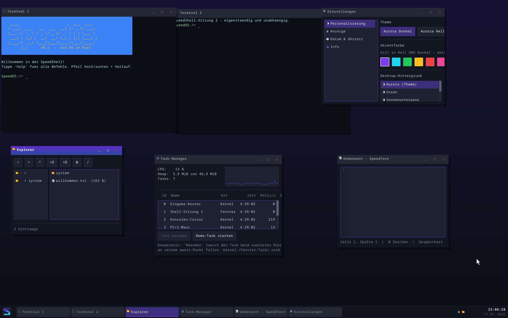
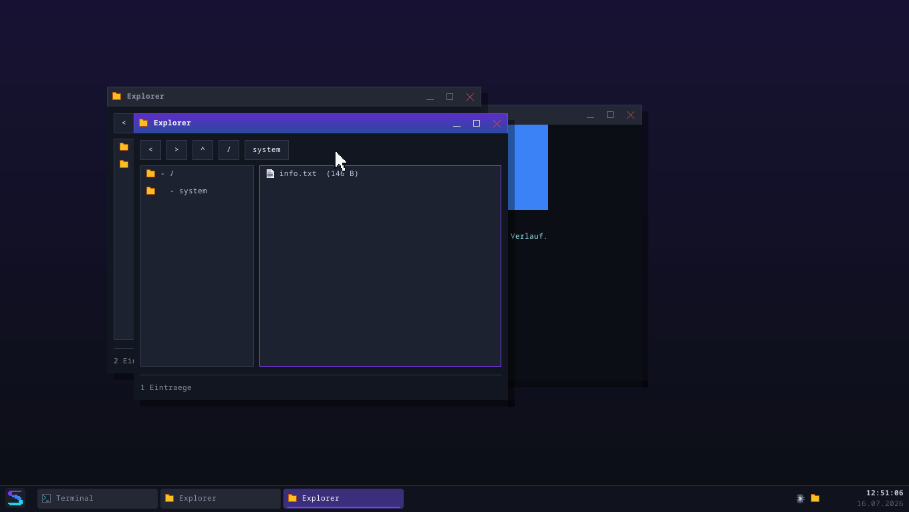
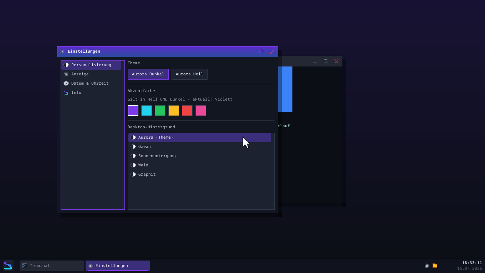
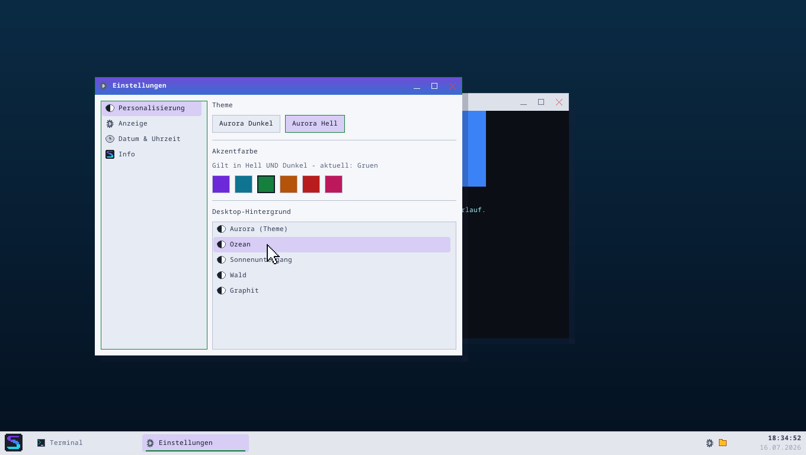
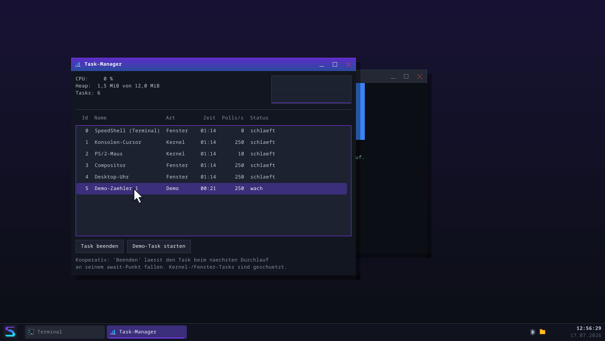
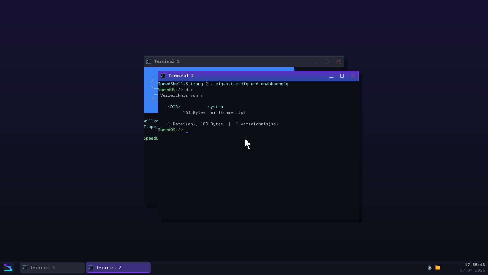
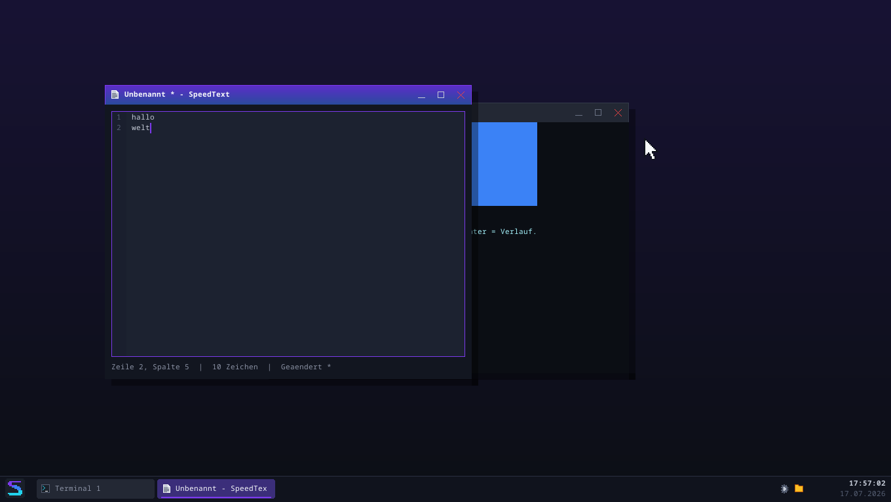
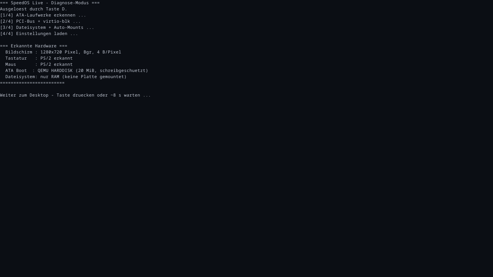

# SpeedOS

Ein Betriebssystem **from scratch in Rust** — kein Linux, keine fremde
Kernel-Basis. Vom Bootsektor bis zur interaktiven Shell mit Dateisystem
ist alles selbst gebaut (auf Basis der bewährten Architektur aus
["Writing an OS in Rust"](https://os.phil-opp.com/) von Philipp Oppermann).

> Lernprojekt: Der Code ist bewusst ausführlich auf Deutsch kommentiert —
> jede Datei erklärt, *was* sie tut und *warum* es so funktioniert.


*Der Serie-3-Desktop in 2560x1600: zwei unabhängige Terminal-Sitzungen, Explorer,
Task-Manager mit Live-CPU-Graph, SpeedText und Einstellungen — sechs Fenster,
sechs Taskleisten-Knöpfe, alles auf dem eigenen UI-Toolkit.*


*SpeedOS bootet direkt in den Desktop: SpeedShell als Terminal-Fenster, Taskleiste mit
Startknopf/Fenster-Knöpfen/Uhr, Startmenü mit App-Registry und Live-Suche.*


*Dasselbe System nach einem Klick auf "Theme wechseln": Aurora Hell — alle UI-Farben
kommen aus dem zentralen Theme-Modul, nur das Terminal bleibt bewusst dunkel.*


*Der Explorer — die erste echte App auf dem Toolkit: Ordnerbaum, Dateiliste,
Breadcrumbs, Zurück/Vor-Verlauf, tippbare Adressleiste, Tastatur-Navigation.*


*Die Einstellungen-App: Theme, Akzentfarbe (unabhängig von Hell/Dunkel) und
Desktop-Verläufe, UI-Skalierung, Uhr-Format — alles wirkt sofort und wird
persistent in /system/einstellungen.txt gespeichert.*


*Drei Klicks später: Aurora Hell + grüner Akzent + Ozean-Hintergrund —
die Wahl überlebt das Schließen der App.*


*Der Task-Manager: echte CPU-Auslastung (TSC-Messung Arbeit vs. hlt-Schlaf)
mit 60-Sekunden-Graph, Heap-Belegung und alle Executor-Tasks mit Namen,
Laufzeit und Polls/s — Demo-Tasks lassen sich kooperativ beenden.*


*Das Ein-Terminal-Limit ist Geschichte: Jedes Terminal-Fenster ist eine eigene
Shell-SITZUNG mit eigenem Task — hier läuft `dir` in Terminal 2, während
Terminal 1 unberührt dahinter wartet.*


*SpeedText, der Texteditor: Zeilennummern, Cursor-Navigation, Statuszeile
(Zeile:Spalte, Zeichen, Änderungs-Status), Titel-Stern bei ungespeicherten
Änderungen, Datei-Dialoge und Schließen-Nachfrage — alles übers VFS.*


*Das UI-Toolkit (ui-Modul): Buttons, Checkbox, Textfeld (ZeilenEditor + blinkender
Cursor), ScrollListe mit Scrollbalken — das Fundament für Explorer & Co.*


*Fenster mit Titelleiste, Icon, Knöpfen (Minimieren/Maximieren/Schließen), Schatten und Aurora-Fokus.*


*Alt+Tab-Fensterwechsler mit zentriertem Overlay und Auswahl-Highlight.*


*Der Boot-Screen: Obsidian-Aurora-Farbverlauf, gerendert Pixel für Pixel.*


*Die SpeedShell auf der Framebuffer-Konsole: help, farbtest, blinkender Cursor.*


*SpeedOS als Live-System vom USB-Stick — der Diagnose-Modus (Taste D beim
Boot) zeigt Boot-Schritte und erkannte Hardware direkt auf dem Bildschirm.
Auf echter Hardware verifiziert (siehe [docs/hardware-log.md](docs/hardware-log.md)),
da es dort keine serielle Debug-Ausgabe gibt.*

## Features (Stand: Juli 2026)

- **Eigenständiger Boot:** `no_std`-Kernel (Target `x86_64-unknown-none`),
  UEFI-Boot über bootloader_api 0.11, startet in QEMU
- **Grafik-Konsole:** linearer Framebuffer (1280x720) mit Double
  Buffering, vorgerastertem Noto-Sans-Mono-Font (Antialiasing,
  Umlaute!), Scrolling per memmove, blinkendem Software-Cursor und
  Obsidian-Aurora-Boot-Screen — alle Ausgaben laufen zusätzlich mit
  ANSI-Farben über die serielle Schnittstelle
- **Absturzsicherheit:** IDT mit Handlern für Breakpoint, Page Fault
  und Double Fault — letzterer mit eigenem Notfall-Stack (IST/TSS),
  sodass selbst ein Kernel-Stack-Overflow sauber gemeldet wird
- **Hardware-Interrupts:** 8259 PIC (remappt), Timer-Ticks,
  PS/2-Tastatur mit deutschem QWERTZ-Layout
- **Speicherverwaltung:** Paging über OffsetPageTable,
  Frame-Allocator aus der Bootloader-Memory-Map, 100-KiB-Kernel-Heap
  mit drei wählbaren Allocatoren (linked_list, Bump, Fixed-Size-Block)
  → `Box`, `Vec`, `String`, `BTreeMap` funktionieren im Kernel
- **Multitasking:** kooperativ mit async/await — eigener Executor mit
  Waker-Support, lock-freien Task-Queues und `hlt`-Schlaf im Leerlauf
- **SpeedShell:** interaktive Kommandozeile mit Befehls-Registry,
  Verlauf (Pfeiltasten), Tab-Vervollständigung und 19 Befehlen —
  läuft im Desktop als Terminal-FENSTER (Ausgabe-Umleitung in ein
  unit-getestetes Text-Raster), auf Wunsch (ESC) auch im Vollbild
- **Desktop:** Fenster-Manager + Compositor (private Fenster-Puffer,
  Dirty-Rects), Theme-System (Aurora Dunkel/Hell — keine hartcodierten
  UI-Farben), Taskleiste (Startknopf, Fenster-Knöpfe, echte RTC-Uhr),
  Startmenü mit App-Registry und Live-Suche (Super-Taste), PS/2-Maus,
  Snap, Alt+Tab, UI-Skalierung 1.0/1.5/2.0
- **UI-Toolkit + Apps:** retained Widget-Baum (`src/ui/`) mit Buttons,
  Textfeld, ScrollListe & Co. — darauf laufen der Explorer (Navigation,
  Dateioperationen, Papierkorb, Kontextmenüs, Strg+C/X/V), die
  Einstellungen-App (Theme/Akzent/Hintergrund, Skalierung,
  Cursor-Blinken, Uhr-Format/-Offset, System-Info), der
  Task-Manager (benannte Executor-Tasks, echte CPU-Auslastung per
  TSC mit Live-Graph, Heap-Anzeige, kooperatives Task-Beenden) und
  SpeedText (mehrzeiliger Editor mit Zeilennummern, Datei-Dialogen
  und Schließen-Nachfrage)
- **Terminal-Sitzungen:** beliebig viele Terminal-Fenster, jedes mit
  eigenem Shell-Task; Kernel-Log geht ans Haupt-Terminal (gepuffert,
  wenn keins offen ist)
- **Einstellungs-Persistenz:** typisierter Schlüssel=Wert-Store, der
  sofort nach /system/einstellungen.txt schreibt und beim Boot lädt —
  die API-Naht, über die später das Disk-Dateisystem echte
  Neustart-Persistenz liefert
- **Dateisystem + Persistenz (Serie 4):** VFS-Abstraktion (Trait
  `FileSystem`) über einem RamFs und **echten Disk-Dateisystemen**.
  Darunter die schmale `BlockDevice`-Naht mit einem eigenen
  **ATA-PIO**-Treiber und einem **virtio-blk**-Treiber (PCI-Enumeration
  + wiederverwendbare Split-Virtqueue). **SpeedFS** ist das eigene
  Disk-Dateisystem (Superblock/Bitmap/Inodes, spezifiziert in
  [docs/speedfs-format.md](docs/speedfs-format.md); Crash-Konsistenz
  ohne Journal, bewiesen durch einen Absturz-Folter-Test + den fsck
  `pruefe.speedfs`). **FAT32** (nur Lesen) liest fremde USB-Sticks; ein
  rotierendes Log liegt auf der Platte. Dateien und Einstellungen
  überleben den Neustart
- **Live-USB-Boot:** `cargo image` baut `speedos-live.img` — ein
  bootfähiges UEFI-Image für echte Hardware (verifiziert auf einem
  **Acer Aspire A515-51**: Boot, Desktop, Tastatur, native 1080p).
  Robust gegen fehlende Geräte (keine PS/2-Eingabe → klare
  Bildschirm-Meldung, keine Platte → RAM-Fallback) plus ein
  Boot-Diagnose-Modus (Taste D). Anleitung: [docs/usb-boot.md](docs/usb-boot.md)
- **Tests:** 146 Lib- plus mehrere Integrationstests, die als eigene
  Mini-Kernel in QEMU booten — inkl. Persistenz-Beweis über den echten
  QEMU-Neustart, großem End-to-End-Test gegen RamDisk/IDE/virtio,
  Absturz-Folter-Test, Frame-Zeit-Messung und Grafik-Clipping-Prüfung

## Bauen & Starten

Voraussetzungen (einmalig):

```
# Rust nightly — Komponenten und Targets installiert rust-toolchain.toml
# im Projektordner automatisch beim ersten cargo-Aufruf.
rustup toolchain install nightly

# QEMU (Windows: https://qemu.weilnetz.de/w64/ oder winget install
# SoftwareFreedomConservancy.QEMU) — qemu-system-x86_64 im PATH oder
# unter C:\Program Files\qemu (die mitgelieferte edk2/OVMF-Firmware
# wird für den UEFI-Boot gebraucht).
```

Dann:

```
cargo run     # baut Kernel + Disk-Image und startet SpeedOS im QEMU-Fenster
cargo test    # führt alle Tests in QEMU aus (headless)
```

Hinter den Kulissen ruft cargo unser `boot/`-Programm als Runner auf:
Es verpackt den Kernel mit `bootloader::UefiBoot` in ein bootfähiges
GPT-Image und startet QEMU. Der allererste Build kompiliert dabei
einmalig die Bootloader-Stages (ein paar Minuten).

### Auflösung wählen

SpeedOS ist auflösungsunabhängig — die Umgebungsvariable
`SPEEDOS_AUFLOESUNG` wählt den Grafikmodus (Standard: 720p, die
flotteste Wahl). Der Runner dimensioniert VRAM und Arbeitsspeicher
automatisch passend:

```
$env:SPEEDOS_AUFLOESUNG="4k"; cargo run        # PowerShell
SPEEDOS_AUFLOESUNG=1080p cargo run             # bash
```


*Derselbe Desktop in 4096x2160 — der Kernel ist auflösungsunabhängig.*

Presets: `720p`, `1080p`, `1200p`, `2k`/`1440p`, `1600p`, `4k`,
`5k`, `8k` — oder frei als `BREITExHOEHE` (z. B. `1600x900`).
1080p und 4K treffen exakt; dazwischen nimmt die Firmware den
nächstgrößeren Modus ihrer Tabelle (720p → 1360x768, 2k → 2560x1600).
5K/8K versteht der Runner, deckelt sie aber ehrlich auf das Maximum
der QEMU-VGA-Firmware (4096x2160) — der Kernel selbst könnte sie
darstellen.


Alternative Heap-Allocatoren zum Experimentieren:

```
cargo test --features bump-allocator          # Bump: schnell, vergisst nichts
cargo test --features fixed-block-allocator   # Frei-Listen fester Größen
```

## Projektstruktur

```
src/
├── main.rs          Kernel-Einstieg: Init-Reihenfolge, Desktop, Executor
├── lib.rs           Kern-Bibliothek: init(), Test-Framework, print-Makros
├── framebuffer.rs   Double Buffering, Font-Rendering, Boot-Screen
├── konsole.rs       FramebufferKonsole: Raster, Farben, Blink-Cursor
├── grafik.rs        Zeichner: Primitive, Clipping, Alpha, Icons
├── theme.rs         Themes (Dunkel/Hell), Akzent-Palette, Metrik, Skala
├── fenster/         Fenster-Manager, Compositor, Taskleiste, Terminal
├── ui/              Widget-Toolkit: Widgets, Layout, App-Trait,
│                    Dialog-Bausteine, mehrzeiliger Texteditor
├── apps.rs          App-Registry (Startmenü-Einträge)
├── explorer.rs      Explorer-App: Navigation, Dateioperationen, Papierkorb
├── einstellungen.rs Einstellungs-Store (VFS-persistent) + Einstellungen-App
├── taskmanager.rs   Task-Manager-App: CPU-Graph, Task-Tabelle, Beenden
├── speedtext.rs     SpeedText-Editor: Datei-Dialoge, Schließen-Nachfrage
├── ablage.rs        Globale Zwischenablage (Strg+C/X/V)
├── maus.rs          PS/2-Maus: Init, Paket-Parsing, Cursor-Overlay
├── serial.rs        Serielle Ausgabe (COM1), parallel zum Bildschirm
├── gdt.rs           GDT/TSS + Notfall-Stack für Double Faults
├── interrupts.rs    IDT, Exceptions, PIC/PIT/LAPIC, Timer & Tastatur
├── memory.rs        Paging: globale API + Bitmap-Frame-Allocator
├── allocator.rs     Kernel-Heap (+ allocator/{bump,fixed_size_block}.rs)
├── zeit.rs          Zeit-API: TSC-Mikrosekunden, warte_ms, Datum
├── rtc.rs           CMOS-Echtzeituhr (einmaliges Lesen beim Boot)
├── task/            Async-Multitasking: Task, Executor, Tastatur-Stream
├── shell/           SpeedShell: Sitzungen, ZeilenEditor, Befehls-Registry
└── fs/              VFS-Trait + RamFs
boot/                Host-Runner: baut das UEFI-Disk-Image, startet QEMU
tests/               Integrationstests (booten einzeln in QEMU)
docs/                Migrationsplan bootloader 0.9 -> 0.11, Screenshots
```

## Roadmap (Kurzfassung)

- [x] Boot, Seriell, Exceptions, Interrupts, Tastatur (QWERTZ)
- [x] Paging, Heap, async/await, Shell, RAM-Dateisystem
- [x] **UEFI-Boot mit linearem Framebuffer** (bootloader 0.11)
- [x] **Grafik-Konsole:** Font-Rendering, Double Buffering, Boot-Screen
- [x] **Desktop:** Maus, Zeichen-Werkzeuge, Fenster mit Compositor,
      Titelleisten, Verschieben/Größe/Min/Max/Close, Snap, Alt+Tab
- [x] **Desktop komplett:** Theme-System (Aurora Dunkel/Hell, zur
      Laufzeit umschaltbar), Taskleiste mit Startknopf/Fenster-Knöpfen/
      Uhr+Datum, Startmenü mit App-Registry und Live-Suche (Super-Taste),
      SpeedShell als Terminal-Fenster — SpeedOS bootet in den Desktop
- [x] **Echte Zeit + 4K:** TSC-Zeitquelle (µs-genau), RTC-Uhrzeit,
      Auflösungswahl bis 4K, UI-Skalierung, Dirty-Rect-Compositing
- [x] **UI-Toolkit + erste Apps:** retained Widget-Baum, Explorer
      (Dateioperationen, Papierkorb, Kontextmenüs, Zwischenablage),
      Einstellungen-App mit persistentem Einstellungs-Store (VFS),
      Task-Manager (benannte Tasks, CPU-Metrik, kooperatives Beenden),
      SpeedText-Editor + Terminal-Sitzungen (eine Shell pro Fenster)
- [x] **Persistenz (Serie 4):** `BlockDevice`-Naht, ATA-PIO- und
      virtio-blk-Treiber (PCI + wiederverwendbare Virtqueue), **SpeedFS**
      (eigenes Disk-Dateisystem mit fsck + Absturz-Folter-Test), FAT32
      (Lesen), rotierendes Platten-Log — Dateien und Einstellungen
      überleben den Neustart (Plan: [docs/serie4-bestandsaufnahme.md](docs/serie4-bestandsaufnahme.md))
- [x] **Live-USB-Boot:** `cargo image` → bootfähiges UEFI-Image für
      echte Hardware (auf einem Acer verifiziert), robust gegen fehlende
      Geräte, mit Diagnose-Modus ([docs/usb-boot.md](docs/usb-boot.md))
- [ ] **Netzwerk (Serie 5, läuft):** virtio-net (interrupt-getriebener
      Empfang) auf der Virtqueue-Basis; die geräteunabhängige Naht
      `NetzGeraet` (analog `BlockDevice`); Ethernet + **ARP** + **IPv4**
      (Checksumme, Fragment-Erkennung) + **ICMP** (`ping`) + **UDP** +
      **DHCP** (holt beim Boot automatisch eine IP) + **DNS**
      (`nslookup <name>`) — **SpeedOS ist im Internet**. TCP folgt —
      Bestandsaufnahme in [docs/serie5-netzwerk.md](docs/serie5-netzwerk.md)
- [ ] **User Space (Serie 6):** Ring-3-Prozesse, Syscalls, präemptiver
      Scheduler
- [ ] Ferner: eigene Programme laden (ELF), DNS/TLS/HTTP, Sound

## Lizenz

Lernprojekt — Code frei verwendbar (MIT).
