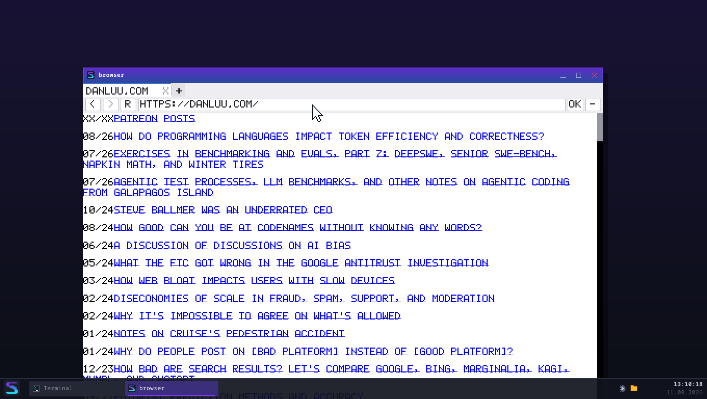
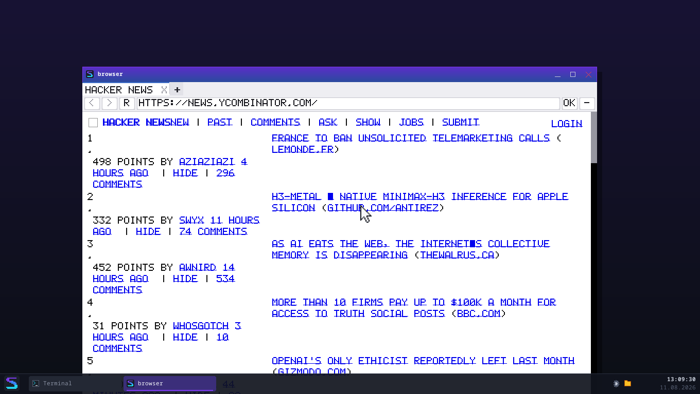
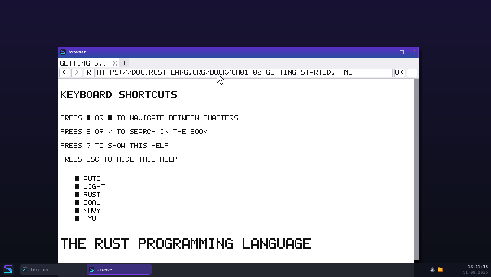
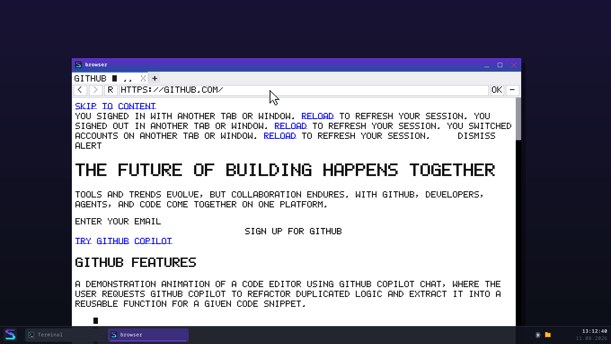

# Zehn echte Webseiten, ehrlich bewertet

*Serie-8-Abschluss — August 2026*

Eine Feature-Liste sagt, was gebaut wurde. Diese Liste sagt, was
**funktioniert** — an Seiten, die niemand für SpeedOS gebaut hat.

Die Zahlen kommen aus `tests/browser_realitaet.rs` (`browser --pruefen`
gegen jede Adresse, aus QEMU über den eigenen Netz-Stack). Die **Urteile
kommen aus dem Augenschein** — und an zwei Stellen widersprechen sie den
Zahlen. Genau deshalb stehen beide hier.

---

## Die Bilanz

| | Seiten |
|---|---|
| **Lesbar** — man kann die Seite benutzen | 5 |
| **Teilweise** — Inhalt da, Darstellung leidet | 3 |
| **Unbrauchbar** — Kernfunktion fehlt | 2 |

Die automatische Bewertung des Tests (Anzeige-Befehle × Höhe) sagte
*8 lesbar / 2 teilweise / 0 unbrauchbar*. **Sie ist an zwei Stellen zu
gutmütig**, und das ist selbst ein Befund: Ein Browser kann viel Text
zeichnen und trotzdem unbenutzbar sein, wenn es der falsche Text ist.

---

## Die Seiten

### 1. `info.cern.ch` — die erste Webseite der Welt (1991) · **LESBAR**

208 Anzeige-Befehle, 679 px, **102 ms**. Überschrift, Definitionsliste,
alle Verweise anklickbar. Kein CSS, kein JavaScript — die Seite ist
genau das, wofür HTML gedacht war.

*Sie ist der Maßstab, gegen den alles andere antritt: So sähe das Web
aus, wenn es beim Hypertext geblieben wäre.*

### 2. `example.com` · **TEILWEISE**

22 Befehle, 164 px, 116 ms. Text und Link sind da und richtig. Aber die
Seite lebt von ihrem CSS (zentrierter Kasten, Schriftwahl) — **das
Stylesheet ist extern und wird nicht geholt**, also steht alles links
oben. Inhaltlich vollständig, gestalterisch nicht.

### 3. `de.wikipedia.org/wiki/Betriebssystem` · **LESBAR**

**8 463 Anzeige-Befehle, 28 348 px hoch, 250 ms.** Der ganze Artikel:
Überschriften, Absätze, Listen, Tabellen, Fußnoten, alle Verweise.
Heap-Spitze 13,9 MB.

Was fehlt: die Seitenleiste steht als Liste über dem Artikel (kein
`float`/`position`), Bilder ohne Maßangabe sind klein, Umlaute fehlen
(„HAUPTMEN▪"). **Der Artikel selbst ist vollständig lesbar** — und das
ist bei einer Enzyklopädie das, worauf es ankommt.

### 4. `danluu.com` — Blog · **LESBAR**

2 586 Befehle, 6 925 px, 147 ms. Die vollständige Artikelliste, alle
Verweise. Der Autor schreibt bewusst schlichtes HTML — und man sieht,
dass sich das auszahlt.

Einziger Mangel: Datum und Titel kleben zusammen (`08/26HOW DO…`), weil
sie in einer Tabelle stehen, deren Abstände aus externem CSS kämen.

### 5. `text.npr.org` — Nachrichten, Textfassung · **LESBAR**

523 Befehle, 1 928 px, 1 140 ms. Eine Seite, die es ernst meint mit
„Text" — Schlagzeilen und Verweise, sonst nichts. Sie funktioniert hier
praktisch perfekt.

### 6. `lite.cnn.com` — Nachrichten, schlank · **LESBAR**

2 778 Befehle, 4 252 px, 237 ms. Wie NPR: eine bewusst reduzierte
Fassung, und genau deshalb brauchbar.

*Bemerkenswert: Beide großen Nachrichtenhäuser pflegen eine
Textfassung — und die ist mit unserem Browser besser benutzbar als die
Hauptseite in einem echten Browser auf einer schlechten Leitung.*

### 7. `news.ycombinator.com` — Forum · **LESBAR**

1 270 Befehle, 3 396 px, 720 ms. Alle Beiträge mit Punktzahl, Autor,
Alter und Kommentarzahl; jeder Verweis anklickbar.

HN baut sein Layout aus Tabellen, und die beherrschen wir — deshalb
sitzt die Nummerierung links und der Titel rechts. Die Zeilen stehen
weiter auseinander als im Original (Tabellen-Abstände aus externem CSS),
aber die Seite ist **vollständig benutzbar**.

### 8. `suckless.org` · **LESBAR**

1 917 Befehle, 10 984 px, 98 ms. Navigation und Text vollständig.

### 9. `doc.rust-lang.org/book/` — Dokumentation · **TEILWEISE**

98 Befehle im ersten Rendering, 770 px, 577 ms.

**Hier zeigt sich die Folge der fehlenden externen Stylesheets am
deutlichsten:** Ganz oben steht ein Tastatur-Hilfe-Overlay und eine
Themenauswahl (`AUTO / LIGHT / RUST / COAL / NAVY / AYU`) — beides ist
im echten Browser per CSS **versteckt**. Ohne dieses CSS erscheint es,
und der Kapiteltext beginnt erst darunter.

Der Text selbst ist danach vollständig und lesbar. Man muss nur an der
Bedienoberfläche vorbeiscrollen, die eigentlich unsichtbar wäre.

### 10. `github.com` — Anwendung · **UNBRAUCHBAR**

777 Befehle, 3 921 px, 172 ms. **Die automatische Bewertung sagt
„lesbar" — sie irrt.**

Was erscheint, ist zum größten Teil Text, den ein Mensch nie sehen
soll:

* „You signed in with another tab or window. Reload to refresh your
  session." — Meldungen für Screenreader, per CSS versteckt.
* „A demonstration animation of a code editor using GitHub Copilot
  Chat…" — der Alternativtext eines Videos.

Dazwischen steht die Marketing-Überschrift. **Von der eigentlichen
Anwendung funktioniert nichts**: keine Anmeldung, keine Suche, kein
Repository, keine Navigation. Das ist kein Darstellungsproblem — es ist
eine Anwendung, die ohne JavaScript nicht existiert.

*Der ehrliche Satz lautet: Wir zeigen die Hülle einer Seite, deren
Inhalt es ohne JavaScript nicht gibt.*

---

## Was daraus folgt

### Die drei Gründe, warum eine Seite hier scheitert

**Nach Häufigkeit, nicht nach Schwere:**

1. **Externe Stylesheets werden nicht geholt** (`<link rel="stylesheet">`).
   Betrifft *jede* der zehn Seiten außer der von 1991. Folgen: kein
   Layout-Raster, keine Abstände — und, viel schlimmer, **alles, was per
   CSS versteckt sein sollte, wird sichtbar**. Das ist der Grund für die
   Rust-Buch- und die github-Ansicht.
2. **Kein JavaScript.** Betrifft nur Seiten, die ihren Inhalt erst im
   Browser bauen — dort aber vollständig. Der Hinweis „braucht
   JavaScript" greift nur bei *ganz* leerem Rumpf; github ist der
   unangenehmere Fall dazwischen: genug Text, um nicht als leer zu
   gelten, und zu wenig, um zu nützen.
3. **Kein `float`, kein `position`.** Seitenleisten und Menüs stehen
   über dem Inhalt statt daneben. Das kostet Ästhetik, selten
   Verständlichkeit.

### Die überraschende Reihenfolge

Vor der Messung hätte man gewettet, dass **JavaScript** das Hauptproblem
ist. Es ist das **CSS**. Acht von zehn Seiten liefern ihren Inhalt
brav im HTML — sie sehen nur falsch aus, weil das Stylesheet fehlt.

**Externe Stylesheets zu holen ist ein Tagesprojekt** (der Cache, die
URL-Auflösung und der CSS-Parser stehen alle schon; es fehlt der Abruf
und ein zweites Blatt in der Kaskade). Eine JavaScript-Engine sind
Monate. Das ist die wichtigste Einzelaussage dieses Berichts — und sie
geht in die Serie-9-Entscheidung ein
([`serie9-bestandsaufnahme.md`](serie9-bestandsaufnahme.md)).

### Was gut funktioniert

* **Textseiten sind wirklich benutzbar.** Wikipedia, HN, danluu, NPR,
  CNN-lite, suckless — sechs Seiten, die man lesen kann, nicht „bei denen
  man erkennt, was gemeint war".
* **Das Laden ist schnell.** 98–250 ms für die meisten Seiten,
  inklusive DNS, TCP, TLS-Handshake und Rendern. Die zwei Ausreißer
  (NPR 1 140 ms, HN 720 ms) sind Server-Antwortzeiten, nicht wir.
* **Nichts ist abgestürzt.** Zehn fremde Seiten, kein Absturz, keine
  Hänger, und danach lief das System unverändert weiter.

---

## Methodik und Grenzen dieses Berichts

* Gemessen in QEMU über slirp-NAT, 720p, Fenster 1200 × 700.
* Die Zahlen stammen aus einem Lauf. Ladezeiten schwanken mit dem Netz;
  die Größenangaben (Befehle, Höhe) nicht.
* Echte Seiten ändern sich. Die Urteile gelten für den Stand vom
  **11. August 2026** — deshalb liegen die Bildschirmfotos dabei.
* `tests/browser_realitaet.rs` lässt den Testlauf **nie rot werden**,
  wenn eine fremde Seite sich ändert oder kein Internet da ist. Die
  einzige Zusage darin: Nach zehn fremden Seiten läuft SpeedOS noch.
