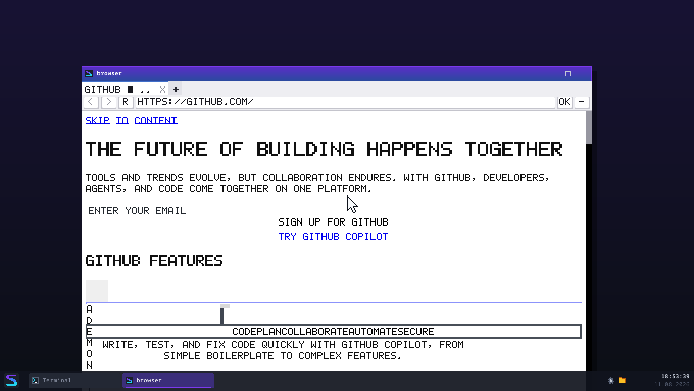
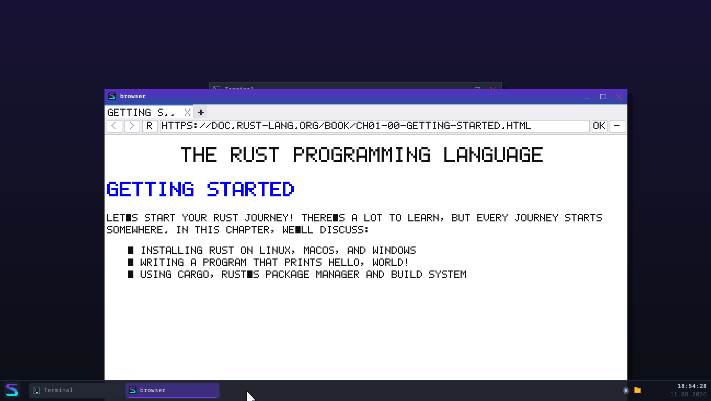
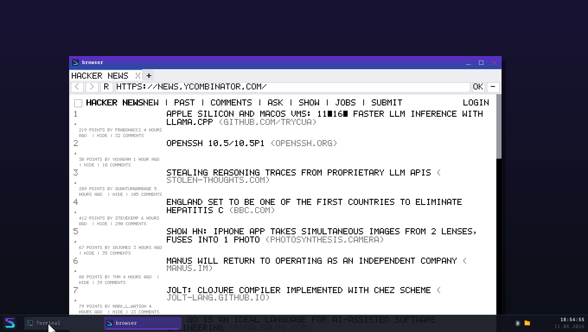
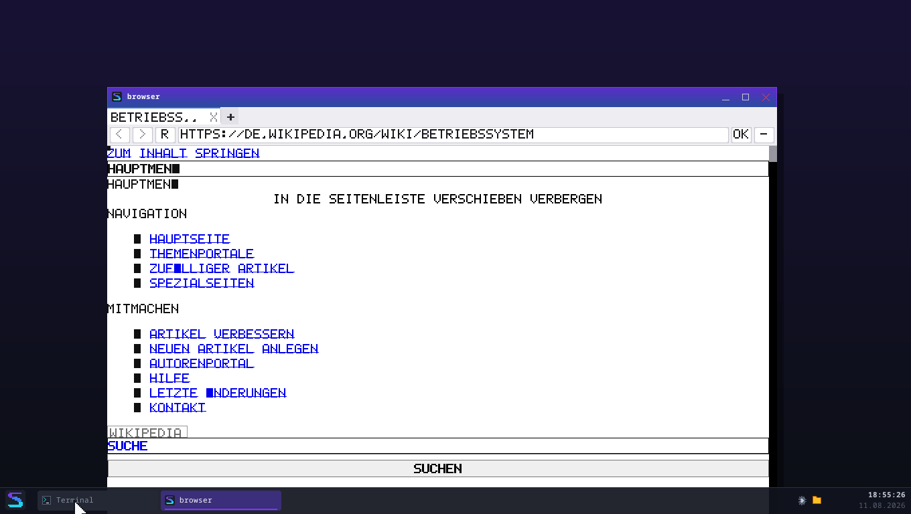

# Zehn echte Webseiten, ehrlich bewertet

*Serie-8-Abschluss — August 2026*

> **Dieses Dokument hat zwei Messungen.** Unten steht die zweite
> ([Serie 9, Teil 1](#zweite-messung-mit-externen-stylesheets)), nachdem
> externe Stylesheets geholt werden. Die erste bleibt **unverändert**
> stehen — auch dort, wo sie sich geirrt hat. Ein Bericht, den man
> nachträglich glattzieht, ist keine Messung mehr, sondern eine
> Behauptung.

Eine Feature-Liste sagt, was gebaut wurde. Diese Liste sagt, was
**funktioniert** — an Seiten, die niemand für SpeedOS gebaut hat.

Die Zahlen kommen aus `tests/browser_realitaet.rs` (`browser --pruefen`
gegen jede Adresse, aus QEMU über den eigenen Netz-Stack). Die **Urteile
kommen aus dem Augenschein** — und an zwei Stellen widersprechen sie den
Zahlen. Genau deshalb stehen beide hier.

---

## Die Bilanz

| | Seiten |
|---|---|
| **Lesbar** — man kann die Seite benutzen | 5 |
| **Teilweise** — Inhalt da, Darstellung leidet | 3 |
| **Unbrauchbar** — Kernfunktion fehlt | 2 |

Die automatische Bewertung des Tests (Anzeige-Befehle × Höhe) sagte
*8 lesbar / 2 teilweise / 0 unbrauchbar*. **Sie ist an zwei Stellen zu
gutmütig**, und das ist selbst ein Befund: Ein Browser kann viel Text
zeichnen und trotzdem unbenutzbar sein, wenn es der falsche Text ist.

---

## Die Seiten

### 1. `info.cern.ch` — die erste Webseite der Welt (1991) · **LESBAR**

208 Anzeige-Befehle, 679 px, **102 ms**. Überschrift, Definitionsliste,
alle Verweise anklickbar. Kein CSS, kein JavaScript — die Seite ist
genau das, wofür HTML gedacht war.

*Sie ist der Maßstab, gegen den alles andere antritt: So sähe das Web
aus, wenn es beim Hypertext geblieben wäre.*

### 2. `example.com` · **TEILWEISE**

22 Befehle, 164 px, 116 ms. Text und Link sind da und richtig. Aber die
Seite lebt von ihrem CSS (zentrierter Kasten, Schriftwahl) — **das
Stylesheet ist extern und wird nicht geholt**, also steht alles links
oben. Inhaltlich vollständig, gestalterisch nicht.

### 3. `de.wikipedia.org/wiki/Betriebssystem` · **LESBAR**

**8 463 Anzeige-Befehle, 28 348 px hoch, 250 ms.** Der ganze Artikel:
Überschriften, Absätze, Listen, Tabellen, Fußnoten, alle Verweise.
Heap-Spitze 13,9 MB.

Was fehlt: die Seitenleiste steht als Liste über dem Artikel (kein
`float`/`position`), Bilder ohne Maßangabe sind klein, Umlaute fehlen
(„HAUPTMEN▪"). **Der Artikel selbst ist vollständig lesbar** — und das
ist bei einer Enzyklopädie das, worauf es ankommt.

### 4. `danluu.com` — Blog · **LESBAR**

2 586 Befehle, 6 925 px, 147 ms. Die vollständige Artikelliste, alle
Verweise. Der Autor schreibt bewusst schlichtes HTML — und man sieht,
dass sich das auszahlt.

Einziger Mangel: Datum und Titel kleben zusammen (`08/26HOW DO…`), weil
sie in einer Tabelle stehen, deren Abstände aus externem CSS kämen.

### 5. `text.npr.org` — Nachrichten, Textfassung · **LESBAR**

523 Befehle, 1 928 px, 1 140 ms. Eine Seite, die es ernst meint mit
„Text" — Schlagzeilen und Verweise, sonst nichts. Sie funktioniert hier
praktisch perfekt.

### 6. `lite.cnn.com` — Nachrichten, schlank · **LESBAR**

2 778 Befehle, 4 252 px, 237 ms. Wie NPR: eine bewusst reduzierte
Fassung, und genau deshalb brauchbar.

*Bemerkenswert: Beide großen Nachrichtenhäuser pflegen eine
Textfassung — und die ist mit unserem Browser besser benutzbar als die
Hauptseite in einem echten Browser auf einer schlechten Leitung.*

### 7. `news.ycombinator.com` — Forum · **LESBAR**

1 270 Befehle, 3 396 px, 720 ms. Alle Beiträge mit Punktzahl, Autor,
Alter und Kommentarzahl; jeder Verweis anklickbar.

HN baut sein Layout aus Tabellen, und die beherrschen wir — deshalb
sitzt die Nummerierung links und der Titel rechts. Die Zeilen stehen
weiter auseinander als im Original (Tabellen-Abstände aus externem CSS),
aber die Seite ist **vollständig benutzbar**.

### 8. `suckless.org` · **LESBAR**

1 917 Befehle, 10 984 px, 98 ms. Navigation und Text vollständig.

### 9. `doc.rust-lang.org/book/` — Dokumentation · **TEILWEISE**

98 Befehle im ersten Rendering, 770 px, 577 ms.

**Hier zeigt sich die Folge der fehlenden externen Stylesheets am
deutlichsten:** Ganz oben steht ein Tastatur-Hilfe-Overlay und eine
Themenauswahl (`AUTO / LIGHT / RUST / COAL / NAVY / AYU`) — beides ist
im echten Browser per CSS **versteckt**. Ohne dieses CSS erscheint es,
und der Kapiteltext beginnt erst darunter.

Der Text selbst ist danach vollständig und lesbar. Man muss nur an der
Bedienoberfläche vorbeiscrollen, die eigentlich unsichtbar wäre.

### 10. `github.com` — Anwendung · **UNBRAUCHBAR**

777 Befehle, 3 921 px, 172 ms. **Die automatische Bewertung sagt
„lesbar" — sie irrt.**

Was erscheint, ist zum größten Teil Text, den ein Mensch nie sehen
soll:

* „You signed in with another tab or window. Reload to refresh your
  session." — Meldungen für Screenreader, per CSS versteckt.
* „A demonstration animation of a code editor using GitHub Copilot
  Chat…" — der Alternativtext eines Videos.

Dazwischen steht die Marketing-Überschrift. **Von der eigentlichen
Anwendung funktioniert nichts**: keine Anmeldung, keine Suche, kein
Repository, keine Navigation. Das ist kein Darstellungsproblem — es ist
eine Anwendung, die ohne JavaScript nicht existiert.

*Der ehrliche Satz lautet: Wir zeigen die Hülle einer Seite, deren
Inhalt es ohne JavaScript nicht gibt.*

---

## Was daraus folgt

### Die drei Gründe, warum eine Seite hier scheitert

**Nach Häufigkeit, nicht nach Schwere:**

1. **Externe Stylesheets werden nicht geholt** (`<link rel="stylesheet">`).
   Betrifft *jede* der zehn Seiten außer der von 1991. Folgen: kein
   Layout-Raster, keine Abstände — und, viel schlimmer, **alles, was per
   CSS versteckt sein sollte, wird sichtbar**. Das ist der Grund für die
   Rust-Buch- und die github-Ansicht.
2. **Kein JavaScript.** Betrifft nur Seiten, die ihren Inhalt erst im
   Browser bauen — dort aber vollständig. Der Hinweis „braucht
   JavaScript" greift nur bei *ganz* leerem Rumpf; github ist der
   unangenehmere Fall dazwischen: genug Text, um nicht als leer zu
   gelten, und zu wenig, um zu nützen.
3. **Kein `float`, kein `position`.** Seitenleisten und Menüs stehen
   über dem Inhalt statt daneben. Das kostet Ästhetik, selten
   Verständlichkeit.

### Die überraschende Reihenfolge

Vor der Messung hätte man gewettet, dass **JavaScript** das Hauptproblem
ist. Es ist das **CSS**. Acht von zehn Seiten liefern ihren Inhalt
brav im HTML — sie sehen nur falsch aus, weil das Stylesheet fehlt.

**Externe Stylesheets zu holen ist ein Tagesprojekt** (der Cache, die
URL-Auflösung und der CSS-Parser stehen alle schon; es fehlt der Abruf
und ein zweites Blatt in der Kaskade). Eine JavaScript-Engine sind
Monate. Das ist die wichtigste Einzelaussage dieses Berichts — und sie
geht in die Serie-9-Entscheidung ein
([`serie9-bestandsaufnahme.md`](serie9-bestandsaufnahme.md)).

### Was gut funktioniert

* **Textseiten sind wirklich benutzbar.** Wikipedia, HN, danluu, NPR,
  CNN-lite, suckless — sechs Seiten, die man lesen kann, nicht „bei denen
  man erkennt, was gemeint war".
* **Das Laden ist schnell.** 98–250 ms für die meisten Seiten,
  inklusive DNS, TCP, TLS-Handshake und Rendern. Die zwei Ausreißer
  (NPR 1 140 ms, HN 720 ms) sind Server-Antwortzeiten, nicht wir.
* **Nichts ist abgestürzt.** Zehn fremde Seiten, kein Absturz, keine
  Hänger, und danach lief das System unverändert weiter.

---

## Methodik und Grenzen dieses Berichts

* Gemessen in QEMU über slirp-NAT, 720p, Fenster 1200 × 700.
* Die Zahlen stammen aus einem Lauf. Ladezeiten schwanken mit dem Netz;
  die Größenangaben (Befehle, Höhe) nicht.
* Echte Seiten ändern sich. Die Urteile gelten für den Stand vom
  **11. August 2026** — deshalb liegen die Bildschirmfotos dabei.
* `tests/browser_realitaet.rs` lässt den Testlauf **nie rot werden**,
  wenn eine fremde Seite sich ändert oder kein Internet da ist. Die
  einzige Zusage darin: Nach zehn fremden Seiten läuft SpeedOS noch.

---
---

# Zweite Messung: mit externen Stylesheets

*Serie 9, Teil 1 — 11. August 2026, derselbe Tag, dieselben zehn
Adressen, dieselbe Bewertungsmethode.*

Die erste Messung endete mit einem Satz, der wie eine Wette klang:
*„Externe Stylesheets zu holen ist ein Tagesprojekt."* Hier steht, was
dabei herauskam — **einschließlich der Vorhersage, die falsch war.**

## Die Bilanz nebeneinander

| | erste Messung | zweite Messung |
|---|---:|---:|
| **Lesbar** | 5 | **7** |
| **Teilweise** | 3 | **2** |
| **Unbrauchbar** | 2 | **1** |
| *(mechanische Bewertung des Tests)* | *8 / 2 / 0* | *8 / 2 / 0* |

**Die mechanische Bewertung hat sich nicht bewegt** — sie zählt
Anzeige-Befehle und Höhe, und beides ändert sich beim CSS-Fix in beide
Richtungen (github: 777 → 1 257 Befehle; Rust-Buch: 98 → 53). Genau das
war schon in der ersten Messung ihr Fehler, und er wird hier nicht
repariert, sondern nur noch einmal gezeigt: **Eine Kennzahl aus Menge
sagt nichts über Brauchbarkeit.** Die Urteile unten kommen wie beim
ersten Mal aus dem Augenschein.

## Was die Zahlen sagen

Neu in `browser --pruefen`: `STIL_*` (wie viele Blätter kamen an, wie
viele Regeln, wie viele Teilbäume fielen dadurch aus dem Kastenbaum) und
`TEXT=` (der sichtbare Text **aus der Anzeigeliste**). Erst mit der
zweiten Zeile ist „der Screenreader-Text ist weg" eine prüfbare Aussage
statt eines Bildschirmfotos.

| Seite | Blätter | CSS-Regeln | CSS-Bytes | versteckte Teilbäume |
|---|---:|---:|---:|---:|
| info.cern.ch | 0 / 0 | 0 | 0 | 1 |
| example.com | 0 / 0 | 4 | 145 | 1 |
| Wikipedia | 3 / 3 | 414 | 267 019 | **54** |
| danluu.com | 0 / 0 | 4 | 170 | 4 |
| text.npr.org | 0 / 0 | 17 | 1 624 | 1 |
| lite.cnn.com | 0 / 0 | 16 | 199 172 | 2 |
| Hacker News | 1 / 1 | 49 | 7 350 | 2 |
| Rust-Buch | 10 / 10 (+1 über Grenze) | 181 | 47 220 | **25** |
| suckless.org | 1 / 1 | 26 | 1 948 | 5 |
| github.com | 10 / 10 (+17 über Grenze) | **4 678** | **1 247 373** | **67** |

**Die erste Überraschung steht in der ersten Spalte:** *Fünf* der zehn
Seiten haben überhaupt kein externes Stylesheet. danluu, NPR, CNN-lite
und example.com liefern ihr CSS inline — und die erste Messung hat bei
example.com genau das falsch erklärt („das Stylesheet ist extern und
wird nicht geholt"). Es war schon damals ein `<style>`-Block; was fehlte,
war nicht der Abruf, sondern `text-align: center` auf einem Körper ohne
Breitenbegrenzung. *(example.com ist zwischen beiden Messungen zudem
umgebaut worden — der Text lautet anders.)*

Der Satz „betrifft *jede* der zehn Seiten außer der von 1991" aus der
ersten Messung war also **zu pauschal**. Richtig ist: Er betrifft die
Seiten, bei denen es wirklich weh tat — Wikipedia, das Rust-Buch, HN und
github.

## Die drei Fälle, an denen man es sieht

### github.com — von Screenreader-Müll zur echten Seite

Vorher standen vier Zeilen über der Seite, die ein Mensch nie sehen soll
(*„You signed in with another tab or window. Reload to refresh your
session."*, dreimal, plus *„Dismiss alert"*), dazu der Alternativtext
eines Videos. Nachher fängt die Seite mit ihrer Überschrift an.

**Und hier ist die Vorhersage gescheitert, die diesen Schritt ausgelöst
hat.** Die Erwartung war: Sobald die externen Blätter da sind, greift
`display: none`, und der Text verschwindet. Er verschwand **nicht** —
obwohl alle zehn Blätter mit 4 678 Regeln geladen waren. Der Grund:
github versteckt diese Meldungen nicht über eine Klasse, sondern über
das HTML-Attribut **`hidden`**, und unsere Kaskade kennt bewusst keine
Attributselektoren.

Das ist der lehrreichste Befund der zweiten Messung: *Man hätte ihn
nicht durch Nachdenken gefunden, nur durch Hinsehen.* Der Fix ist zehn
Zeilen (`kaskade::hidden_deklarationen`) und ausdrücklich **keine**
Aufweichung der Regel „keine Attributselektoren": `hidden` ist eine
Aussage der HTML-Spezifikation über das Element, kein Stil. Dazu kam
`<template>` ins Standard-Stylesheet — sein Inhalt ist ein Bauplan für
JavaScript und gehört nie auf den Schirm.

**Urteil: weiterhin UNBRAUCHBAR** — aus dem Grund, der schon beim ersten
Mal der eigentliche war. Es fehlt nicht das CSS, es fehlt die Anwendung:
keine Anmeldung, keine Suche, kein Repository. Was sich geändert hat:
Man sieht jetzt eine Marketing-Seite statt einer Fehlermeldungshalde.

### `doc.rust-lang.org/book` — das Overlay ist weg

Der deutlichste Einzelfall. Vorher füllten das Tastatur-Hilfe-Overlay
(*„PRESS ? TO SHOW THIS HELP"*) und die Themenauswahl
(*AUTO / LIGHT / RUST / COAL / NAVY / AYU*) den ganzen ersten Bildschirm;
der Kapiteltitel stand ganz unten. Nachher beginnt die Seite mit
*„The Rust Programming Language / Getting Started"*.

25 Teilbäume fallen durch die geladenen Blätter aus dem Kastenbaum. Die
Zahl der Anzeige-Befehle **sinkt** dabei von 98 auf 53 — deshalb bleibt
die mechanische Bewertung bei *teilweise*, obwohl die Seite unvergleichbar
besser ist.

**Urteil: LESBAR** (vorher *teilweise*). Der ehrliche Abzug: Das
Inhaltsverzeichnis ist jetzt ebenfalls unsichtbar — mdbook blendet es
ohne JavaScript aus und lässt es per Skript einblenden. Wir zeigen damit
genau das, was ein echter Browser mit abgeschaltetem JavaScript zeigt.
Von diesem Kapitel aus kommt man ohne Adressleiste nicht weiter.

### Hacker News — aus einer blauen Wand wird eine Liste

HN braucht nur **ein** Blatt mit 49 Regeln, und es verändert alles:
Titel schwarz statt blau, Punktzahl/Autor/Kommentare klein und grau,
Domains grau. Vorher passten vier Beiträge auf den Bildschirm, nachher
sieben — und man sieht auf einen Blick, was Titel ist und was Beiwerk.

**Urteil: LESBAR** (war es vorher auch, ist es jetzt deutlich mehr).

### Wikipedia — hier hat sich am Eindruck nichts geändert

3 Blätter, 414 Regeln, 54 versteckte Teilbäume — und die Seitenleiste
steht **weiterhin** als lange Liste über dem Artikel. Das war nie ein
Stylesheet-Problem: Sie steht dort, weil wir kein `float`, kein
`position` und kein Flexbox haben. Der Artikel selbst ist wie vorher
vollständig lesbar.

**Urteil: LESBAR** (unverändert). Ein nützlicher Gegenbeleg — er zeigt,
was der CSS-Fix *nicht* kann.

## Die neue Reihenfolge der Fehlerursachen

Nach Häufigkeit, gemessen statt vermutet:

1. **Kein `float`, kein `position`, kein Flexbox.** Jetzt die häufigste
   Ursache. Betrifft Wikipedia, github, jede Seite mit Seitenleiste oder
   mehrspaltigem Raster. Was vorher unter „kostet Ästhetik" lief, ist
   der größte verbliebene Posten.
2. **Kein JavaScript.** Unverändert: betrifft eine der zehn Seiten
   vollständig (github) und eine teilweise (das Inhaltsverzeichnis des
   Rust-Buchs).
3. **`@media` wird übersprungen.** Neu sichtbar, weil wir das CSS jetzt
   *haben*: lite.cnn.com liefert 199 KB CSS und daraus bleiben **16
   Regeln** — der Rest steckt in Media-Queries. Bei „mobile first"
   gebauten Seiten bekommen wir das Grundgerüst und sonst nichts.
4. **Die Blätter-Obergrenze greift auf großen Seiten.** github fordert
   27 Stylesheets an; wir holen 10. Bisher nur bei github und (mit
   einem) beim Rust-Buch.

## Was der Fix gekostet hat

* **Ladezeit:** unauffällig. Die Seiten mit externen Blättern brauchen
  100–540 ms statt vorher 172–577 ms — der Unterschied liegt im
  Rauschen der Server-Antwortzeiten. Das serielle Holen fällt nicht auf,
  solange es ein bis drei Blätter sind.
* **Speicher:** Wikipedia 14,1 MB Heap-Spitze (vorher 13,9), github
  14,8 MB. Das CSS liegt nur während der Kaskade im Speicher; danach
  werden die Blätter fallengelassen.
* **Kaskade:** github hat jetzt 4 678 Regeln gegen ~5 000 Knoten. Das
  ist die Größenordnung, bei der der in `serie9-bestandsaufnahme.md`
  notierte Regel-Index nach Tag/Klasse anfangen würde, sich zu lohnen.

## Methodik dieser zweiten Messung

* Gleiche zehn Adressen, gleiches Fenster (1200 × 700), gleiche
  Bewertungsfunktion in `tests/browser_realitaet.rs` — **nicht angefasst**,
  damit der Vergleich etwas wert ist.
* Neu ausgegeben, aber **nicht** in die Bewertung eingehend: `STIL_*`
  und `TEXT=`.
* Die Bildschirmfotos entstanden von Hand über `tools/qmp_steuern.py`
  gegen dasselbe Fenster wie beim ersten Mal.
* Echte Seiten ändern sich zwischen zwei Messungen. HN zeigt andere
  Beiträge, example.com wurde umgebaut. Wo das ein Urteil berührt, steht
  es dabei.
