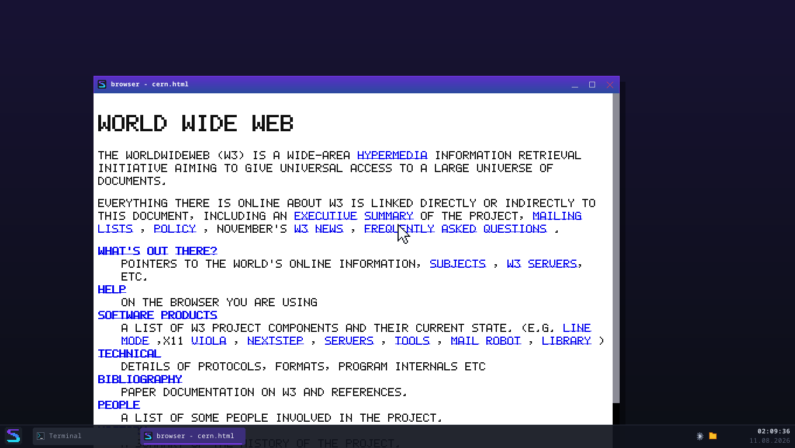

# Aus Anzeige-Befehlen wird ein Bild — und was ein Scroll-Frame kostet

*Serie 8, Teil 7 — August 2026*

Dieses Dokument hält drei Dinge fest: **wie** gemalt wird, **wann** was
neu gemacht wird (die Invalidierungs-Regeln), und — der eigentliche Anlass —
**die Entscheidung zum Umstiegskriterium** aus
[`fenster-syscalls.md` §5](fenster-syscalls.md), das in Serie 8, Teil 1
*vor* dem ersten Renderer festgeschrieben wurde.



*`starte browser /platte/seiten/cern.html &` — `info.cern.ch` von 1991, in
einem Ring-3-Prozess mit eigenem Adressraum. Überschrift, Links, Einrückung
der Definitionsliste und Scrollbalken kommen aus dem Layout von Teil 6; die
Pixel aus `speedpaint`. Prüfseite B (ein Wikipedia-Artikel, 8463
Anzeige-Befehle) liegt daneben:
[`serie8-browser-wikipedia.png`](screenshots/serie8-browser-wikipedia.png).*

---

## 1. Der Painter

`speedpaint::malen` ist eine Schleife über eine Liste. Das ist keine
Untertreibung, sondern der Ertrag der Entscheidung aus Teil 6, das Layout
in **Befehlen** münden zu lassen statt in Pixeln:

```
Anzeigeliste + Sicht --[maler]--> Zeichen-Aufrufe auf einer Leinwand
```

| Befehl | wird zu |
|---|---|
| `Rechteck` | `Leinwand::fuellen` |
| `Text` | `Leinwand::text_stil` (mit Schnitt) |
| `Linie` | `fuellen` (waagerecht/senkrecht mit Dicke), sonst `linie` |
| `Bild` | `Leinwand::bild` — oder Platzhalter-Rahmen + `alt`-Text |

Der Maler hat **keinen Zustand über den Aufruf hinaus**, keine Rekursion
und kein Layout-Wissen. Wer dort etwas über Kästen oder Vererbung liest,
hat einen Fehler gefunden.

### Die sechste Kiste hängt an `speedui` — und das ist keine Aufweichung

`speedlayout` hat `speedui` ausdrücklich *nicht* genommen (es braucht
Textmetrik, kein Toolkit). Hier liegt der Fall genau andersherum, und
deshalb ist es dieselbe Regel und nicht ihre Ausnahme:

* Ein Maler braucht eine **Zeichenfläche**. `Leinwand` *ist* diese
  Abstraktion, hat seit Teil 2 zwei Wirte und ist genau dafür
  geschnitten. Ein eigenes `Malflaeche`-Trait wäre ein zweiter Name für
  dieselbe Sache gewesen — jeder Wirt müsste beide bedienen.
* Und das Argument, das bei `speedlayout` *für* ein eigenes Trait sprach,
  spricht hier **dafür**: die Tests.
  `speedui::attrappe::MalProtokoll` zeichnet nicht, sondern schreibt mit.

Die Richtung stimmt: `speedpaint` → `speedui`, nie umgekehrt.
`speedui/Cargo.toml` hat weiterhin einen leeren `[dependencies]`-Block,
und `tools/speedui_allein_bauen.ps1` prüft das.

### Eine elfte Leinwand-Operation

`Leinwand::bild(ziel, quell_breite, quell_hoehe, rgba)` — mit
Voreinstellung, nach dem Muster von `text_stil` in Teil 3: **kein Widget
braucht sie, nur der Renderer.** Die Voreinstellung malt einen Rahmen und
nicht nichts; ein Wirt, der keine Bilder kann, soll den *Platz* des
Bildes zeigen.

---

## 2. Scrollen

Der ganze Zustand sind drei Zahlen (`speedpaint::Sicht`): wo das Fenster
auf der Leinwand liegt, wie hoch das gesetzte Dokument ist, und wie weit
heruntergescrollt wurde.

**Der Versatz ist der einzige Weg, auf dem sich Scrollen im Bild
auswirkt.** Die Anzeigeliste bleibt Byte für Byte dieselbe. Das steht
nicht in einem Kommentar, sondern im Typ: `malen` bekommt sie als
`&`-Referenz und kann sie nicht anfassen; es gibt keinen Pfad von einem
Scroll-Ereignis zu `speedlayout::setzen`. Geprüft von
`test_scrollen_laesst_das_layout_in_ruhe` (50 Schritte, Liste danach
identisch).

### Der Streifen

Ein Scroll-Schritt liefert eine `Folge`: wie weit verschoben wurde und
welcher Streifen deshalb neu zu malen ist.

* `|Verschiebung| < Fensterhöhe` → eigene Pixel verschieben
  (`Fenster::senkrecht_verschieben`, ein `copy_within`), nur den neuen
  Rand malen.
* Sonst → alles neu; vom alten Bild bliebe ohnehin nichts stehen.

Geklemmt wird an **einer** Stelle (`Sicht::klemmen`), durch die jeder Weg
läuft — Rad, Tasten, Balken, Größenänderung. Deshalb kann kein Weg über
Anfang oder Ende hinausschießen.

> **Der Streifen spart das MALEN, nicht die KOPIE.**
> Der Kernel hat eine eigene Kopie des Fensterpuffers und weiß von der
> Verschiebung nichts — es muss anschließend trotzdem die ganze Fläche
> übertragen werden. Einen „Fenster scrollen"-Syscall gibt es nicht, und
> er wäre ein Sonderfall im ABI für genau einen Anwendungsfall.
> Genau das macht die Messung in §4 interessant.

### Die Vorzeichen-Lehre

Die erste Fassung scrollte mit dem Mausrad in die **falsche Richtung**,
und beide Klemmungs-Tests waren trotzdem grün. Der Grund ist lehrreich:
Sie fassen das Rad zwar an, aber jeweils dort, wo ohnehin nichts passieren
darf — am Anfang nach oben, am Ende nach unten. Das tut in *jeder*
Konvention nichts.

Seitdem prüft `test_rad_richtung` aus der **Mitte** des Dokuments. Und die
Konvention richtet sich jetzt nach `maus.rs` („positiv = nach oben"),
nicht nach dem, was in `sicht.rs` für sich genommen hübscher aussah: Zwei
Vorzeichen-Konventionen für dasselbe Gerät im selben System sind ein
Bedienfehler, egal welche einzeln die schönere ist.

---

## 3. Die Invalidierungs-Regeln

`speedpaint::invalidierung::entscheiden` ist eine reine Funktion
`Anlass -> Massnahme`. Sie steht dort und nicht als `if`-Kette in der
Ereignisschleife, damit jede Regel ein Testfall ist — und damit der
Browser die Regeln wirklich benutzt, die geprüft werden.

| Anlass | Maßnahme | Warum |
|---|---|---|
| **Fensterbreite** geändert | `NeuLayouten` | Das Layout hängt an genau einer Zahl von außen: der Breite. |
| **nur Fensterhöhe** geändert | `Alles` (kein Layout) | Die Höhe geht in kein Layout ein. Gemalt werden muss trotzdem: Der Fensterpuffer ist nach `Groesse` **neu und leer**. |
| **Scrollen** | `Teil(Streifen)` | Nie layouten. Der Versatz ist eine Anzeige-Größe. |
| **Bild geladen** | `Teil(sein Rechteck)` | Nie layouten — siehe unten. |
| **neue Seite** | `NeuLayouten` | — |
| **Thema geändert** | `Alles` | Farben ändern keine Maße. |

Treffen mehrere zusammen, gewinnt die teuerste (`verstaerken`); zwei
Teil-Bereiche werden zu ihrer Bounding-Box vereinigt — Korrektheit vor
Optimum, dieselbe Entscheidung wie bei der Widget-Schadensmeldung in
Serie 3.

**Regel 2 ist die, die man übersieht.** Ein Dokument, das 4000 px hoch
ist, ist das in einem 300 px und in einem 900 px hohen Fenster. Beim
Ziehen am unteren Fensterrand fällt damit jedes Layout weg.

**Regel 4 gilt bei uns ausnahmslos**, und der Grund ist nachprüfbar:
`speedlayout` fragt ein Bild nie nach seiner Größe. Der Kasten entsteht
aus `width`/`height` (Stil schlägt Attribut) oder — wenn beides fehlt —
aus einem festen Platzhalter von 32×32. Ein ankommendes Bild kann die
Geometrie also gar nicht ändern. Der Preis steht in
[`grenzen.md`](grenzen.md): Ein `` ohne Maßangabe wird in 32×32
gequetscht. Echte Browser layouten nach dem Laden neu — das kostet den
berüchtigten Seitensprung und eine Layout-Runde je Bild.

---

## 4. Die Messung und die Entscheidung

### Das Kriterium (Wortlaut aus `fenster-syscalls.md` §5)

> Geteilter Speicher wird neu bewertet, wenn ein Scroll-Frame über
> **~8 ms** braucht **UND** die Kopie **mehr als die Hälfte** davon
> ausmacht.

Beide Bedingungen, weil ein langsamer Frame genauso gut am *Malen* liegen
kann — dann würde geteilter Speicher nichts ändern.

### Die Methode

`browser --messen=200` an **Prüfseite B** (dem Wikipedia-Artikel,
293 KiB, im Image eingebettet), aus Ring 3, mit dem echten Programm.
Reproduzierbar:

```bash
cargo test --test browser_rendern
```

```bash
SPEEDOS_AUFLOESUNG=4k cargo test --test browser_rendern
```

**Bester von fünf Durchgängen, nicht Mittelwert** — dieselbe Methodik wie
`messung` Modus 1, und hier zwingend: Der Scheduler nimmt alle 20 ms die
CPU weg, und bei 4K arbeitet der Compositor nebenher an derselben Fläche.
Diese Fremdzeit gehört nicht zum Scroll-Frame.

> **Ohne diese Vorsichtsmaßnahme ist die 4K-Messung nicht
> entscheidungsfähig.** Das ist keine Vermutung: Zwei Läufe der ersten
> Fassung ergaben **7300 µs** und **9150 µs** — einmal unter, einmal über
> der 8-ms-Schwelle. Ein Kriterium, das je nach Lauf anders ausfällt,
> entscheidet nichts. Mit dem Bestwert liegen drei aufeinanderfolgende
> Läufe bei 6800 / 7050 / 7325 µs.

### Die Zahlen

Prüfseite B: **8463 Anzeige-Befehle**.

| | 720p-Klasse (1360×696) | 4K (3840×2088) |
|---|---:|---:|
| Dokumenthöhe | 26 742 px | 21 047 px |
| Layout (einmalig) | 6–9 ms | 37–41 ms |
| **Malen** (Streifen) | 50–125 µs | 1 975 µs |
| **Kopie** (`fenster_zeichnen`) | 450–800 µs | 5 750 µs |
| **Scroll-Frame** | **500–925 µs** | **7 050–7 725 µs** |
| Anteil Kopie | 86–90 % | 74 % |
| Vollbild malen (Vergleich) | 600–700 µs | 4 400 µs |
| Heap-Spitze | 14,1 MiB | 42,6 MiB |
| **Kriterium** | **nicht erfüllt** | **nicht erfüllt** |

Die Spannen sind echte Streuung zwischen Läufen, kein Ablesefehler — auch
mit dem Bestwert-Verfahren bleibt Restrauschen (der Compositor läuft
nebenher). Bei 720p ist das gleichgültig: Selbst der schlechteste Wert
liegt eine Größenordnung unter der Schwelle. Bei 4K ist es genau der
Grund, warum es das Verfahren braucht.

### Die Entscheidung: der Pixelpuffer-Ansatz bleibt

Das Kriterium ist in beiden Auflösungen **nicht erfüllt**, also wird
geteilter Speicher *nicht* neu bewertet. Der Entwurf aus Teil 1 —
Pixelpuffer per Syscall, `copy_in`, der Kernel kopiert — bleibt, und mit
ihm die Sicherheitszusage, die er kostenlos mitbringt.

**Aber die 4K-Zahl ist knapp, und das wird hier nicht weggeschrieben:**
7,0–7,7 ms sind 88–97 % der Schwelle. Die ehrliche Fassung des Befunds
lautet nicht „reichlich Luft", sondern „gerade eben".

### Die Gegenrechnung — der eigentliche Befund

Die Messung *enthält* bereits die Streifen-Optimierung. Wie stünde das
Kriterium ohne sie, wenn ein Scroll-Frame die ganze Fläche neu malte?
Der Test rechnet es bei jedem Lauf aus:

| 4K | Frame | Anteil Kopie | Kriterium |
|---|---:|---:|---|
| mit Streifen | 7 050 µs | 74 % | nicht erfüllt |
| **ohne Streifen** | **9 725–10 150 µs** | **52–56 %** | **erfüllt** |

> **Das Streifen-Zeichnen ist der Grund, warum das Kriterium bei 4K nicht
> reißt.** Ohne es wären beide Bedingungen erfüllt, und dieses Dokument
> müsste einen Entwurf für geteilten Speicher enthalten.

Damit ist die in der Aufgabe vorgesehene Reihenfolge — *erst die
naheliegenden Optimierungen, dann neu messen* — nicht nachträglich
angewandt worden, sondern sie ist der Inhalt von Aufgabe 2. Die zweite
genannte Optimierung (**Textstücke cachen**) ist **nicht nötig und
deshalb nicht gebaut**: Das Malen ist mit 1 975 µs von 7 050 µs der
kleinere Posten, und es zu halbieren brächte den Frame auf 6 060 µs — es
verschöbe das Verhältnis in die falsche Richtung (der Kopie-Anteil
stiege auf 86 %), ohne die Schwelle zu unterschreiten, die ohnehin nicht
erreicht wird.

### Was passieren müsste, damit es doch reißt

Ein Fenster deutlich über 4K oder eine Seite, deren Streifen viel teurer
zu malen ist (viele Bilder je Zeile). **Dann, und erst dann,** entsteht
das Entwurfs-Dokument, das erklärt, wie geteilter Speicher die Isolation
wahrt — nicht vorher. Das Kriterium wird nicht verschoben.

---

## 5. Was das Messen sonst noch gekostet hat

**Der User-Heap musste von 12 auf 64 MiB wachsen** (`prozess::HEAP_MAX_BYTES`).

Serie 8, Teil 1 hatte das vorhergesagt („ein größeres Prozess-Layout
(ABI-Änderung) oder Streifen") — gerissen ist die Grenze dann aber nicht
am Fenster, sondern am **Dokument**: `browser` auf dem Wikipedia-Artikel
starb bei 12 249 304 belegten Bytes, noch in 720p. Ein großes Dokument
liegt mehrfach im Speicher (Quelltext, DOM, berechnete Stile je Knoten,
Kastenbaum, Anzeigeliste), und dazu kommt der Fensterpuffer.

Es bleibt eine **harte** Grenze — sie wurde angehoben, nicht abgeschafft.
Ein Programm, das Amok läuft, bekommt weiterhin `KeinPlatz` (14), der
Abstand zum Stack ist mit 32 MiB sogar größer als vorher, und Seiten
werden weiter nur auf Anforderung gemappt: `hallo` braucht keine einzige.

Nebeneffekt: **Die offene Grenze aus Teil 1 ist damit geschlossen.** Ein
4K-Vollbild-Fenster (32,1 MiB Puffer) passt jetzt in den User-Heap; die
Messung oben läuft in 3840×2088 ohne Kürzung, `HOEHE_GEKUERZT` gibt es
nicht mehr.

---

## 6. Prüfung

* **34 Host-Tests** (`speedpaint`, 0,01 s): Painter gegen das
  Mal-Protokoll (landen die Befehle an der richtigen Stelle, wird der
  Hintergrund zuerst gefüllt, wird Durchsichtiges übersprungen, wird das
  Clip wiederhergestellt, wird ein zu kurzer Bildpuffer abgelehnt),
  Scroll-Klemmung an beiden Enden und gegen Überlauf, Streifenlage und
  -inhalt, Balken-Geometrie, jede Invalidierungs-Regel einzeln.
* **3 QEMU-Tests** (`tests/browser_rendern.rs`): Prüfseite A geht durch
  die ganze Kette; die Messung samt Kriterium und Gegenrechnung; fünf
  Läufe ohne einen einzigen verlorenen Frame.

Die harte Zusage im Messtest ist `malen < voll` — ein Streifen muss
billiger zu malen sein als die ganze Fläche. Ohne sie wäre die
Verschiebe-Mechanik dieses Teils Arbeit ohne Gewinn.
