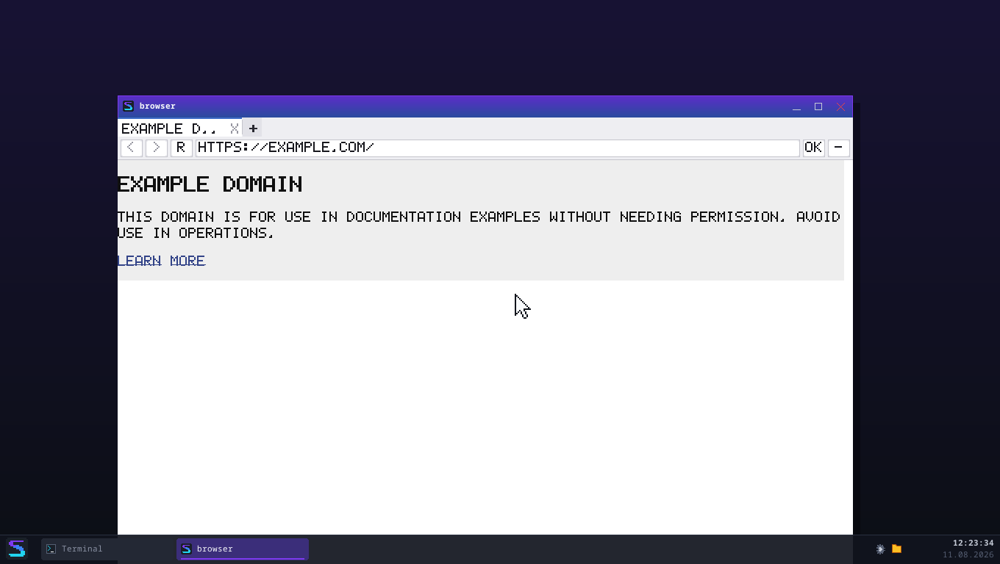

# Der Browser

*Serie 8, Teil 8 — August 2026*

`browser example.com` — und die Seite steht da. Adresse eintippen,
Wikipedia erscheint, Links funktionieren, Zurück funktioniert. Auf dem
eigenen Kernel, dem eigenen TCP/IP-Stack, dem eigenen TLS-Weg, im eigenen
Prozess, mit dem eigenen Renderer.

Teil 7 hat aus Anzeige-Befehlen ein Bild gemacht. Hier wird aus dem
Renderer ein **Browser**: Tabs, Verlauf, Adressleiste, Lesezeichen,
Fehlerseiten, asynchrone Bilder — und der Teil, auf den es bei einem
Browser ohne JavaScript ankommt: **zu sagen, was er nicht kann.**

*Die Bildfolge des Meilensteins (statt eines Videos — die QMP-Fernsteuerung
kann Einzelbilder, keine Aufzeichnung):*
[Adresse geladen](screenshots/serie8-browser-example.png) →
[Link geklickt, andere Seite](screenshots/serie8-browser-link.png) →
[zwei Tabs](screenshots/serie8-browser-tabs.png) →
[`speedos:info`](screenshots/serie8-browser-info.png) →
[Startmenü-Eintrag](screenshots/serie8-browser-startmenue.png)

---

## 1. Wo was liegt

Der Browser selbst **verdrahtet nur**. Wer in `userland/src/bin/browser/`
Parser-, Layout- oder Netz-Logik findet, hat einen Fehler gefunden:

| Kiste | Aufgabe | Tests |
|---|---|---:|
| `speedhtml` | Bytes → Dokumentbaum | 63 (Host) |
| `speedcss` | Baum + Regeln → berechnete Stile | 56 (Host) |
| `speedlayout` | Stile + Breite → Anzeige-Befehle | 60 (Host) |
| `speedpaint` | Befehle → Pixel, Scrollen, Invalidierung | 35 (Host) |
| `speedhttp` | HTTP zerlegen **und URLs auflösen** | 25 (Host) |
| `speedui` | Widgets, Themen, Leinwand | 45 (Host) |
| `libspeed` | Fenster, Netz, Bilder, Heap | — |

Der Browser hat sechs Module: `main` (Ereignisschleife), `ort`, `tab`,
`laden`, `chrome`, `seiten`, `merkliste`.

---

## 2. Die URL-Auflösung — der Teil, den man unterschätzt

Bis Teil 7 gab es `naechstes_ziel` für **Weiterleitungen**, und das
reichte. Ein `href` ist etwas anderes: Er hat `..`, Fragmente, Query-
Referenzen und schema-relative Formen — alles Dinge, die eine
`Location:` praktisch nie hat.

`speedhttp::verweis_aufloesen` folgt RFC 3986 §5.2 in der Teilmenge, die
wir brauchen:

| Referenz auf `https://a.example/x/y.html` | Ergebnis |
|---|---|
| `z.html` | `https://a.example/x/z.html` |
| `../oben.html` | `https://a.example/oben.html` |
| `/neu` | `https://a.example/neu` |
| `?q=2` | `https://a.example/x/y.html?q=2` |
| `//cdn.example/b.png` | `https://cdn.example/b.png` |
| `#kapitel` | **dieselbe Seite**, nur Fragment |
| `mailto:…` | `SchemaNichtNavigierbar` |

Drei Entscheidungen, die dabei zählen:

* **`..` über die Wurzel hinaus verpufft.** `/../../etc/passwd` ist
  `/etc/passwd`. Das ist die Spezifikation *und* die Sicherheitsfrage —
  und weil lokale Dateien denselben Normalisierer benutzen
  (`pfad_normalisieren`), kann ein `href` auch aus einem Seiten-Ordner
  nicht ausbrechen.
* **Ein `href="#oben"` lädt gar nichts.** Es ist der häufigste Verweis
  auf einer langen Seite; wer ihn als Ladevorgang behandelt, holt bei
  jedem Klick aufs Inhaltsverzeichnis die ganze Seite neu.
* **`mailto:` und `javascript:` sind keine kaputten URLs.** Sie bekommen
  einen eigenen Fehlerwert, damit der Browser „öffnet SpeedOS nicht"
  sagen kann statt „ungültige Adresse".

Die Serie-5- und Serie-7-Funktionen sind dabei **unverändert geblieben**
— `test_alte_funktionen_unveraendert` nagelt fest, dass `naechste_url`
weiterhin *nicht* normalisiert. Das ist kein Versehen, sondern der Beweis,
dass die neue Schicht aufgesetzt und nichts umgebaut wurde.

---

## 3. Tabs

Ein Tab ist ein **vollständiger Browser-Zustand**: Dokument, Stile,
Anzeigeliste, Scroll-Position, Verlauf, geladene Bilder. Nichts davon ist
geteilt — deshalb ist ein Tab-Wechsel eine Zeigeränderung und kein
Neuladen.

Geteilt sind genau zwei Dinge, und beide aus gutem Grund: der **Klient**
(eine TLS-Konfiguration mit 119 Wurzeln zweimal aufzubauen wäre
Verschwendung) und der **Cache**.

Der Verlauf ist **pro Tab**, wie in jedem Browser. Beim Navigieren fällt
alles hinter der aktuellen Stelle weg — wer zurückgeht und dann etwas
Neues aufruft, hat den alten Vorwärts-Zweig verlassen.

---

## 4. Bilder: asynchron, mit bewusstem Reflow

**Eines je Durchgang, nicht alle auf einmal.** Der Abruf blockiert; wer
in einer Runde zehn Bilder holt, friert die Oberfläche für die Summe
aller Abrufe ein. So ist der Browser zwischen zwei Bildern bedienbar, und
die Bilder erscheinen nacheinander — das Verhalten, das man kennt.

### Der Reflow — und was sich gegenüber Teil 7 geändert hat

Teil 7 hatte die Regel: *ein geladenes Bild löst NIE ein Neu-Layout aus*,
mit der damals richtigen Begründung — `speedlayout` fragte ein Bild nie
nach seiner Größe, **konnte** also gar nichts ändern. Der Preis stand in
`grenzen.md`: Ein `` ohne Maßangabe wurde in 32×32 gequetscht.

Jetzt kann es. `Metrik::bild_masse` (Voreinstellung `None`) liefert die
Eigengröße, sobald der Wirt sie kennt, und dasselbe Dokument ergibt ein
anderes Layout. Damit wird die Invalidierungs-Regel zu einer **echten
Fallunterscheidung**:

| Fall | Maßnahme |
|---|---|
| Bild hatte `width`/`height` | nur sein Rechteck neu malen |
| Bild hatte **keine** Angabe | **neu setzen** (der Seitensprung) |

Geändert hat sich nicht die Regel, sondern was das Layout kann — deshalb
wurde die Regel nachgezogen und nicht der Test passend gemacht. Beide
Hälften sind geprüft: `speedlayout::test_geladenes_bild_aendert_das_layout`
zeigt, dass das Layout wirklich ein anderes wird, und
`speedpaint::test_regel_bild_ohne_massangabe_layoutet_neu`, dass die
Regel es verlangt.

Die **halbe Angabe** ist dabei der Fall, den man vergisst:
`` an einem 800×600-Bild muss 200×150 ergeben und nicht
200×32 — sonst quetscht jede Seite, die nur die Breite vorgibt.

---

## 5. Der Ehrlichkeits-Teil

### `speedos:info`

Eine eingebaute Seite, die auflistet, was dieser Browser kann und was
nicht — inklusive **„kein JavaScript"**. Sie steht absichtlich *im
Browser* und nicht nur in `grenzen.md`: Wer sie braucht, sitzt gerade vor
einer Seite, die komisch aussieht.

### Die leere Seite wird erkannt

Der häufigste Fehlerfall eines Browsers ohne JavaScript ist kein Absturz,
sondern **nichts**: Die Seite lädt, der Parser ist zufrieden, das Layout
rechnet — und es steht kein Wort darin, weil der Inhalt per Skript
entsteht.

Erkannt wird das an **zwei** Bedingungen, die beide zutreffen müssen:

1. Im gesetzten Dokument steht kein nennenswerter Text.
2. Es gibt `<script>`-Blöcke.

Die zweite allein wäre falsch (fast jede Seite hat Skripte), die erste
allein auch (eine Seite darf leer sein). Zusammen sind sie verlässlich —
`test_leere_js_seite_wird_erkannt` prüft beide Richtungen, inklusive der
Gegenprobe mit einer Seite, die Text *und* Skript hat.

Statt einer weißen Fläche erscheint dann ein Hinweis, der sagt, was los
ist und wo `speedos:info` steht. Der **Ort** der Seite bleibt dabei der
der echten Seite: Neu laden und Lesezeichen zeigen auf sie, nicht auf den
Hinweis.

### Sicherheitsfehler sind laut und unumgehbar

`AbrufFehler::ist_sicherheitsfehler()` (Serie 7, Teil 5) entscheidet, und
die beiden Fälle bekommen **verschiedene Seiten**, nicht ein rotes Wort
auf derselben:

* Verbindungsfehler → es kann sich lohnen, es noch einmal zu versuchen.
* Zertifikatsfehler → es lohnt sich nicht.

Auf der Sicherheitsseite steht **kein Knopf, der weiterführt**. Kein
„trotzdem fortfahren", keine Ausnahmeliste. Das ist die Dauerregel aus
Serie 7 — der Satz „Ein Schalter wird benutzt, sobald es ihn gibt" gilt
für Knöpfe genauso.

---

## 6. Die Oberfläche

Widgets aus `speedui` (`Textfeld` mit dem Zeileneditor aus Serie 3,
`Button` mit Hover und Deaktiviert-Zustand), aber **ohne `UiFenster`**:
Das legt seinen Baum immer über die ganze Leinwand, und dieses Fenster
gehört zur Hälfte dem Renderer. Die fünf Widgets werden deshalb einzeln
gehalten und gezeichnet — das `Widget`-Trait kann genau das.

Die Tab-Leiste ist selbst gezeichnet: Ein Reiter hat einen gekürzten
Titel, einen eigenen Schließen-Knopf und einen Zustand. Als Widget wäre
das mehr Code, nicht weniger.

Für den allgemeinen Fall gibt es trotzdem eine saubere Lösung:
**`speedui::TeilLeinwand`** meldet die Größe eines Ausschnitts und
verschiebt jede Koordinate — damit passt ein vollständiger Widget-Baum in
einen Streifen, ohne davon zu wissen. Sie wird hier nicht gebraucht, aber
sie ist die Antwort auf „Toolkit oben, Eigenes unten", und sie ist
getestet.

### Zwei Tastatur-Befunde

* **Strg+H *ist* Backspace.** Beide sind U+0008 — das stammt aus der
  Fernschreiber-Zeit und gilt in jedem Terminal. Weil unsere Fenster-ABI
  keine Modifikatortasten hat (`grenzen.md`), kann der Browser sie nicht
  unterscheiden. Aufgelöst wird am Kontext, so wie es jeder Browser
  ohnehin tut: Cursor in der Adressleiste → Backspace, sonst → Verlauf.
  Ohne diese Reihenfolge öffnet **jeder** Backspace beim Tippen einer
  Adresse den Verlauf — genau das ist beim ersten Probelauf passiert.
  Dieselbe Kollision haben 9 (Tab), 13 (Enter) und 27 (Esc); sie werden
  deshalb keine Kürzel.
* **Enter leert das Textfeld.** Es ist das Eingabefeld der *Shell*, und
  dort beendet Enter eine Zeile: Der `ZeilenEditor` legt sie in seinen
  Verlauf und leert sich. Wer erst das Ereignis schickt und dann `text()`
  liest, bekommt einen leeren String und lädt nichts. Der Text wird
  deshalb **vorher** gelesen.

Beide Fehler waren im Code nicht zu sehen und im laufenden Programm
sofort.

---

## 7. Ins System integriert

Alles läuft über **eine** Funktion, `programme::browser_oeffnen(adresse)`:

* **Startmenü** — ein Eintrag mit Weltkugel-Icon. Der erste Eintrag, der
  einen Ring-3-Prozess startet statt eines Kernel-Fensters.
* **Explorer** — Doppelklick auf eine HTML-Datei. Erkannt wird das
  **zuerst am Inhalt** (`<!doctype html`, `<html`, …) und nur notfalls an
  der Endung. Bei Programmen ist es umgekehrt (dort sind die ersten Bytes
  die Wahrheit und eine Endung nur eine Behauptung) — HTML hat aber keine
  verlässliche Signatur, also ist die Endung hier der Notnagel und nicht
  die Abkürzung.
* **Shell** — `browser [adresse]`, ohne `&`: Der Befehl startet den
  Prozess selbst im Hintergrund. `hole` bleibt daneben bestehen, weil es
  etwas anderes tut (Bytes holen, pipe-fähig).

Das ist die „Registrierung als Standard": keine Zuordnungstabelle,
sondern eine Funktion, an der man sieht, was passiert.

---

## 8. Was fehlt

Vollständig in [`grenzen.md`](grenzen.md). Die wichtigsten:

* **Kein JavaScript.** Gar keins.
* Formulare werden angezeigt, aber nicht abgeschickt. Keine Cookies,
  keine Anmeldung.
* Externe Stylesheets (`<link rel=stylesheet>`) werden **nicht** geholt —
  nur `<style>`-Blöcke im Dokument.
* Die Schrift ist das 5×7-Raster: nur ASCII, alles GROSS, keine Umlaute.
  Die *Breiten* stimmen, Zeilen brechen also richtig um.
* Kein Suchen in der Seite, keine Textauswahl, kein Zoom.
* Der Scroll-Versatz wird beim Umlegen auf eine neue Fensterbreite nur
  geklemmt, nicht inhaltlich mitgeführt.

---

## 9. Prüfung

* **284 Host-Tests** in den sechs Kisten, zusammen unter einer Sekunde.
* **8 QEMU-Tests** (`tests/browser.rs`): lokale Seite mit Titel,
  relative Verweise, `speedos:info`, unbekannte eingebaute Seite,
  Fehlerseite, JavaScript-Befund in beide Richtungen, Lesezeichen-Format,
  fünf Läufe ohne verlorenen Frame.
* **3 QEMU-Tests** (`tests/browser_rendern.rs`): die Messung aus Teil 7
  läuft mit dem neuen Browser weiter — das Umstiegskriterium bleibt
  reproduzierbar.

Das Vehikel für die Tests ist `browser --pruefen`: Es lädt eine Seite und
gibt maschinenlesbar aus, was dabei herauskam (Titel, Zustand, Fehler,
Sicherheitsbefund, JavaScript-Diagnose, aufgelöste Verweise). Es ist der
**vierte Debug-Blick** neben `htmldump` („Parser oder Layout?"),
`cssdump` („welche Regel?") und `cssdump --layout` („was kommt heraus?")
— und beantwortet die Frage, die erst mit einem Browser entsteht: **„Was
hätte der Benutzer gesehen?"**
