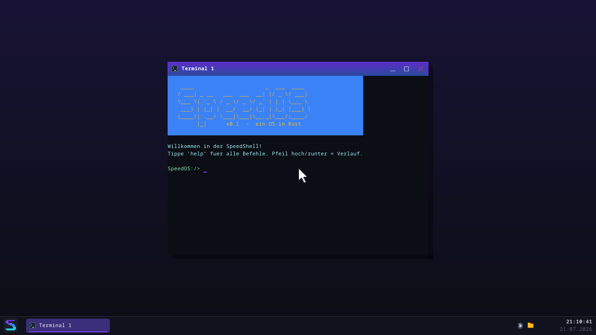
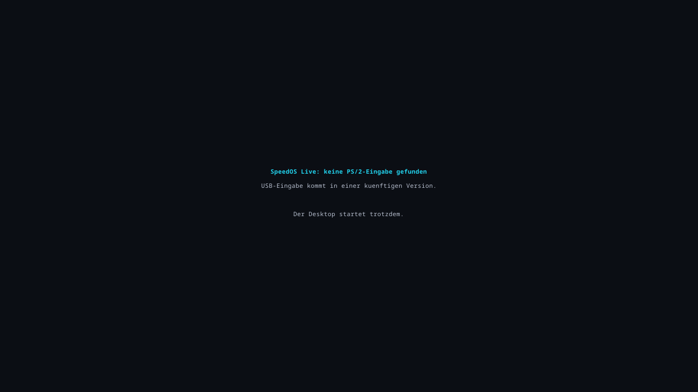

# SpeedOS vom USB-Stick booten (Live-System)

Diese Anleitung zeigt, wie du SpeedOS als **Live-System** auf echter
Hardware startest: Image bauen → in QEMU proben → auf einen USB-Stick
schreiben → am PC/Laptop booten.

> **Was „Live-System" bedeutet:** SpeedOS läuft komplett im
> Arbeitsspeicher. Es wird **nichts** auf deine Festplatte oder den
> Stick geschrieben, und beim Ausschalten ist alles wieder weg
> (Persistenz gibt es nur in QEMU über die Daten-Platte). Dein
> vorhandenes Windows/Linux bleibt völlig unangetastet. USB-Eingabe
> (Tastatur/Maus über xHCI) ist noch nicht gebaut — dazu unten mehr.

---

## Schritt 0 — Image bauen

Im Projekt-Ordner:

```
cargo image
```

Das erzeugt **`speedos-live.img`** im Projekt-Root — ein bootfähiges
GPT-Image mit EFI-System-Partition (UEFI-Boot). `cargo image -- --release`
baut die kleinere/schnellere Variante.

---

## Schritt 1 — ERST in QEMU proben (dringend empfohlen)

Bevor du irgendetwas auf einen echten Stick schreibst, probiere genau
dieses Image in der virtuellen Maschine:

```
.\tools\live_qemu.ps1                 # Standard-Desktop (1280x720)
.\tools\live_qemu.ps1 -Breite 1920 -Hoehe 1080
.\tools\live_qemu.ps1 -KeinePS2       # simuliert fehlende PS/2-Eingabe
```

Bootet es in QEMU sauber bis zum Desktop, ist die halbe Miete drin.

---

## Schritt 2 — Image auf den USB-Stick schreiben

> ## ⚠️ WARNUNG: das RICHTIGE Laufwerk erwischen!
> Das Schreiben **löscht den Ziel-Datenträger vollständig und
> unwiderruflich**. Wählst du versehentlich deine System- oder
> Datenplatte, sind diese Daten **weg**. Prüfe das Ziel **zweimal**
> — am sichersten über die **Größe** (ein 16-GB-Stick ist eben ~15 GB,
> keine 500 GB) und indem du **alle anderen USB-Datenträger vorher
> abziehst**.

Das Image ist ein **komplettes Datenträger-Abbild** (mit Partitions-
tabelle). Es muss **roh auf das ganze USB-Gerät** geschrieben werden —
nicht in eine Partition, nicht per „kopieren", nicht per Formatieren.

### Variante A — Rufus (empfohlen, einfach)

1. [Rufus](https://rufus.ie) starten (portabel, keine Installation nötig).
2. **Laufwerk** oben: den USB-Stick auswählen — **an der Größe prüfen!**
3. **Auswahl** → `speedos-live.img` wählen.
   Erscheint der Dialog „ISOHybrid-Image", **„Im DD-Abbild-Modus
   schreiben"** wählen (das schreibt roh — genau das, was wir wollen).
4. **START** → die letzte Warnung bestätigen (alle Daten auf dem Stick
   gehen verloren).

### Variante B — Balena Etcher

1. [balenaEtcher](https://etcher.balena.io) starten.
2. „Flash from file" → `speedos-live.img`.
3. „Select target" → den USB-Stick (**Größe prüfen!**).
4. „Flash!".

### Variante C — `dd` (Windows, für Fortgeschrittene)

Erst die Datenträger-Nummer des Sticks sicher bestimmen:

```powershell
Get-Disk        # Nummer und Groesse ablesen -- den Stick an der Groesse erkennen!
```

Dann mit einem echten `dd`-Port (z. B. aus den
[dd-for-Windows](http://www.chrysocome.net/dd)-Tools). **Ersetze `N`
durch die korrekte Datenträger-Nummer — ein Fehler hier zerstört das
falsche Laufwerk:**

```
dd if=speedos-live.img of=\\.\PhysicalDriveN bs=1M
```

Unter Linux/macOS ginge es analog mit `sudo dd if=speedos-live.img
of=/dev/sdX bs=4M status=progress` (auch hier: `/dev/sdX` ist das
GANZE Gerät, nicht `/dev/sdX1`, und die Wahl ist genauso kritisch).

---

## Schritt 3 — BIOS/UEFI richtig einstellen

Beim Einschalten ins BIOS/Firmware-Setup (meist **Entf**, **F2** oder
**F10** direkt nach dem Anschalten) und prüfen:

- **Secure Boot: AUS.** Unser Bootloader ist nicht signiert; mit Secure
  Boot verweigert die Firmware den Start. (Das ist die häufigste Ursache,
  wenn nichts passiert.)
- **UEFI-Boot statt Legacy/CSM.** SpeedOS bootet **nur** über UEFI. Ein
  reiner „Legacy"/„CSM"-Modus findet das Image nicht.
- **Fast Boot: ggf. AUS.** Erleichtert den Zugang zum Boot-Menü und
  frisches USB-Erkennen.

Dann neu starten und ins **Boot-Menü** (oft **F12**, **F10** oder
**Esc**) — dort den USB-Stick als **UEFI**-Eintrag wählen (er steht
meist als „UEFI: <Stick-Name>" da).

Tipp: Wenn es zickt, einen **USB-2.0-Port** (oft die schwarzen, nicht
die blauen) probieren — manche Firmwares mögen die xHCI-Handoff-Phase
mit unserem schlanken Bootloader nicht.

---

## Schritt 4 — Was beim ersten Boot passiert

1. Kurz die **UEFI-Firmware**, dann der **Aurora-Bootscreen**
   („SpeedOS", ~1,5 Sekunden).
2. Danach der **Desktop** mit einem Terminal-Fenster, Taskleiste und
   Uhr — genau wie in QEMU:

   

3. **Tastatur:** funktioniert, wenn die Firmware eine PS/2-Tastatur
   bereitstellt oder **USB-Legacy-Emulation** anbietet (viele Desktop-
   Boards tun das, viele moderne Laptops nicht).
4. **Maus:** funktioniert eher **nicht** — USB-Legacy-Maus-Emulation ist
   Glückssache. Der Cursor sitzt dann in der Mitte; der Desktop ist per
   **Tastatur** bedienbar (Startmenü über die Windows-Taste, Alt+Tab,
   Tab/Pfeile).
5. Findet SpeedOS **gar keine** PS/2-Eingabe, erscheint statt eines
   stillen Hängers eine klare Meldung:

   

### Diagnose-Modus (Taste D)

Da es auf echter Hardware **keine serielle Debug-Ausgabe** gibt, kannst
du auf dem **Bootscreen die Taste D drücken**: SpeedOS zeigt dann die
Boot-Schritte und die **erkannte Hardware** direkt auf dem Bildschirm —
ideal, um zu sehen, was gefunden wurde (Bildschirm-Auflösung, Tastatur/
Maus, Laufwerke):


---

## Ehrliche Erwartung

- **Voller Erfolg:** bootet + Desktop + Tastatur funktioniert.
- **Kein Scheitern, sondern erwartbar:** die Maus tut nichts (USB-Legacy
  ist Glückssache). Das ist okay — echte USB-Eingabe (xHCI) ist ein
  Projekt für eine spätere Serie.
- **Keine Persistenz:** alles läuft im RAM, ein Neustart setzt alles
  zurück. Fehlt eine Platte, arbeitet SpeedOS im RAM-Dateisystem weiter
  (kein Fehler).

Bitte trage dein Ergebnis (mit **Fotos**!) in
[`docs/hardware-log.md`](hardware-log.md) ein — Gerät, was ging, was nicht.

---

## Wenn es nicht bootet — Checkliste

| Symptom | wahrscheinliche Ursache |
|---|---|
| Firmware ignoriert den Stick | Secure Boot noch AN, oder nur Legacy/CSM aktiv |
| Stick taucht im Boot-Menü nicht auf | nicht im DD-/Roh-Modus geschrieben; anderes Schreib-Tool probieren |
| Schwarzer Bildschirm nach Auswahl | anderen USB-Port (USB 2.0) probieren; in QEMU gegentesten |
| Es bootet, aber Eingabe tot | keine PS/2- und keine USB-Legacy-Emulation — per Taste D die Diagnose ansehen |
